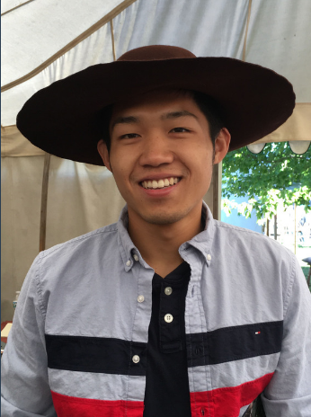

Hello! I'm Yizhou Shan, I've recently graduated from [University of California San Diego](https://cse.ucsd.edu/).

I'm joining [Huawei Cloud](https://www.huaweicloud.com/intl/en-us/) as a Research Scientist
to continue my research on making [Resource Disaggregation](https://github.com/lastweek/2022-UCSD-Thesis/blob/main/Yizhou_Shan_Dissertation_2022.pdf)
practical and deployable in public clouds.

Contact: **ys** AT **ucsd** DOT **edu**

You can find my [CV here](http://lastweek.io/pubs/Yizhou_Shan_CV.pdf).

??? tip "Research News"
	- [_Mar 2022_] Serve as [ChinaSys'22 PC]()
	- [_Mar 2022_] Serve as [APSys'22 PC]()
	- [_Mar 2022_] Defended. The full defense slide is [here](./pubs/Defense_Slides_Yizhou_Shan.pdf).
	- [_Oct 2021_] Serve as [EuroSys'22 Shadow PC](https://2022.eurosys.org/)
	- [_Sep 2021_] We made our [SuperNIC]() paper public.
	- [_Sep 2021_] Serve as [SOSP'21 Artifact Evaluation PC]()
	- [_Aug 2021_] We made our [Clio]() paper public.
	- [_Jun 2021_] Start my final internship at Microsoft Research, working on Security + System.
	- [_Jun 2021_] I proposed my thesis and became a Ph.D candidate.
	- [_Jan 2021_] The DPM work is accepted to present at [NVMW'21](http://nvmw.ucsd.edu/)
	- [_Jan 2021_] This summer, I'm going to do my last internship at [MSR Redmond](https://www.microsoft.com/en-us/research/group/security-and-privacy-research-group-redmond/) on [cloud confidential computing](https://azure.microsoft.com/en-us/solutions/confidential-compute/).
	- [_Dec 2020_] Invited to join the [2021 JSys Student Editorial Board](https://escholarship.org/uc/jsys/studenteb)
	- [_Oct 2020_] Serve as [EuroSys'21 Shadow PC](https://www.eurosys2020.org/call-for-shadow-pc-participation/)
	- [_Sep 2020_] Serve as [OSDI'20 Artifact Evaluation PC](https://sysartifacts.github.io/osdi2020/organizers.html)
	- [_Sep 2020_] Serve as ASPLOS'21 External Reviewer. First major conference review!
	- [_Apr 2020_] __Disaggregated Persistent Memory__ accepted to __ATC'20__
	- [_Feb 2020_] Talk about [FPGA OS](https://cseweb.ucsd.edu/~yiying/cse291j-winter20/reading/FPGA-Virtualization.pdf)
	- [_Sep 2019_] Moved to UCSD.
	- [_May 2019_] Intern at [VMware Research](https://research.vmware.com/), with [Marcos K. Aguilera](http://mkaguilera.kawazoe.org/)
	- [_Apr 2019_] __Storm__ accpeted to __SYSTOR'19__. Awarded Best Paper.
	- [_Jan 2019_] Short paper on __Disaggregated Persistent Memory__ accpeted to __NVMW'19__
	- [_Jul 2018_] __LegoOS__ accepted to __OSDI'18__. Awarded Best Paper.
	- [_May 2018_] Intern at [VMware Research](https://research.vmware.com/), with [Stanko Novakovic](https://sites.google.com/site/stankonovakovic/).

## Conferences

My main research interests are ondistributed system, networking, OS, hardware (FPGA), and their intersections.
I'm getting into Confidential Computing, ML, and database recently.

Full list at [Google Scholar](https://scholar.google.com/citations?user=qgxGqYAAAAAJ&hl=en).

6. __Disaggregating and Consolidating Network Functionalities with SuperNIC__
    *Yizhou Shan*, Will Lin, Ryan Kosta, Arvind Krishnamurthy, Yiying Zhang
    [[Preprint]](https://arxiv.org/pdf/2109.07744.pdf)
       [[Code]]()
5. __Clio: A Hardware-Software Co-Designed Disaggregated Memory System__
    *Yizhou Shan*, Zhiyuan Guo (co-first authors), Xuhao Luo, Yutong Huang, Yiying Zhang
    *__ASPLOS '22__*
       [[Paper]](http://lastweek.io/pubs/ASPLOS22-Clio.pdf)
       [[Code]](https://github.com/WukLab/Clio)
       [[Slide]]()
4. __Disaggregating Persistent Memory and Controlling Them Remotely: An Exploration of Passive Disaggregated Key-Value Stores__
    Shin-Yeh Tsai, *Yizhou Shan*, Yiying Zhang
    *__ATC 2020__*
       [[Paper]](http://lastweek.io/pubs/ATC20-DPM.pdf)
       [[Code]](https://github.com/WukLab/pDPM)
       [[Slide]](https://github.com/WukLab/pDPM/blob/master/Documentation/ATC20-pDPM-slides.pdf)
       [[Short-Talk]](https://www.youtube.com/watch?v=zEVhlb9J-Iw)
       [[Full-Talk]](https://youtu.be/Oexu-3Sfbxk)
       [[Keynote]](https://www.icloud.com/keynote/0Ox0HGeoa5L1pQ7txzyU_RkUA#ATC20-pDPM-iCloud-Public)

3. __Storm: a fast transactional dataplane for remote data structures__
    Stanko Novakovic, *Yizhou Shan*, Aasheesh Kolli, Michael Cui, Yiying Zhang, Haggai Eran, Liran Liss, Michael Wei, Dan Tsafrir, Marcos Aguilera
    *__SYSTOR 2019__* __(Best Paper Award)__
       [[Paper]](http://lastweek.io/pubs/SYSTOR19-Storm.pdf)
       [[Slide]](http://www.systor.org/2019/slides/S6P1%20Storm%20A%20Fast%20Transactional%20Dataplane%20for%20Remote%20Data%20Structures.pdf)
       [[Talk]](https://www.youtube.com/watch?v=3ozwrzUVUJ4)

2. __LegoOS: A Disseminated, Distributed OS for Hardware Resource Disaggregation__
    *Yizhou Shan*, Yutong Huang, Yilun Chen, Yiying Zhang
    *__OSDI 2018__* __(Best Paper Award)__
       [[Paper]](https://www.usenix.org/conference/osdi18/presentation/shan) [[Code]](https://github.com/WukLab/LegoOS)
       [[Slide]](https://www.usenix.org/sites/default/files/conference/protected-files/osdi18_slides_shan.pdf)
       [[Keynote-iCloud]](https://www.icloud.com/keynote/0__Wok6UPN175iDFEuGW9YVkA#LegoOS-OSDI18-Keynote)
       [[Talk]](https://www.youtube.com/watch?v=GX74Q2-ZOQE)

1. __Distributed Shared Persistent Memory__
    *Yizhou Shan*, Shin-Yeh Tsai, Yiying Zhang
    *__SoCC 2017__*
       [[Paper]](http://lastweek.io/pubs/SoCC17-Hotpot.pdf) [[Code]](https://github.com/WukLab/Hotpot)
       [[Slide]](http://lastweek.io/pubs/slides/Yizhou-Hotpot-SoCC17.pptx)
       [[Poster]](http://lastweek.io/pubs/slides/Poster-Hotpot-SoCC17.pptx)

## Workshops

5. __Disaggregating Persistent Memory and Controlling Them Remotely: An Exploration of Passive Disaggregated Key-Value Stores__
    Shin-Yeh Tsai, *Yizhou Shan*, Yiying Zhang
    *12th Annual Non-Volatile Memories Workshop (__NVMW 2021__)*
       [[Paper]](http://lastweek.io/pubs/ATC20-DPM.pdf)

4. __Challenges in Building and Deploying Disaggregated Persistent Memory__
    *Yizhou Shan*, Yutong Huang, Yiying Zhang
    *10th Annual Non-Volatile Memories Workshop (__NVMW 2019__)*
       [[Paper]](http://lastweek.io/pubs/NVMW19-DPM.pdf)

3. __Disaggregating Memory with Software-Managed Virtual Cache__
    _Yizhou Shan_, Yiying Zhang
    *2018 Workshop on Warehouse-scale Memory Systems (__WAMS 2018__) (co-located with ASPLOS '18)*  [[Paper]](http://workshops.inf.ed.ac.uk/wams/)

2. __Distributed Shared Persistent Memory__
    *Yizhou Shan*, Shin-Yeh Tsai, Yiying Zhang
    *9th Annual Non-Volatile Memories Workshop (__NVMW 2018__)*  [[Paper]](https://engineering.purdue.edu/WukLab/hotpot-socc17.pdf)

1. __Disaggregated Operating System__
    Yiying Zhang, *Yizhou Shan*, Sumukh Hallymysore
    *17th International Workshop on High Performance Transaction Systems (__HPTS 2017__)*  [[Paper]](http://hpts.ws/papers/2017/lego.pdf)

## Posters

3. __Lego: A Distributed, Decomposed OS for Resource Disaggregation__ [PDF](https://lastweek.github.io/pubs/SOSP17-Lego-Poster.pdf)
     *Yizhou Shan*, Yilun Chen, Yutong Huang, Sumukh Hallymysore, Yiying Zhang
     Poster at __SOSP 2017__

1. __Disaggregated Operating System__ [PDF](https://lastweek.github.io/pubs/SoCC17-Lego-Poster.pdf)
     *Yizhou Shan*, Sumukh Hallymysore, Yutong Huang, Yilun Chen, Yiying Zhang
     Poster at __SoCC 2017__

## Social

:surfer: :rowboat: :basketball: :football:  

* [Google Scholar](https://scholar.google.com/citations?user=qgxGqYAAAAAJ&hl=en)
* [Github](https://github.com/lastweek)
* [Twitter](https://twitter.com/Yizhou_Shan)
* [LinkedIn](https://www.linkedin.com/in/lastweek/)
* [Goodreads](https://www.goodreads.com/user/show/117378875-yizhou-shan)
