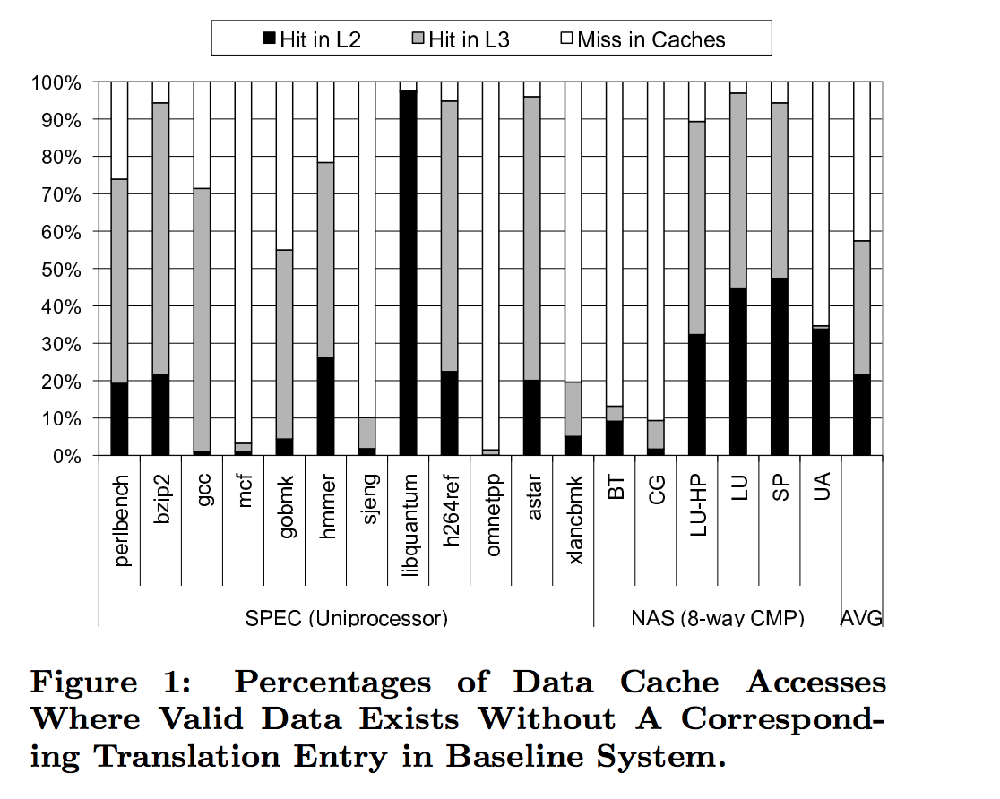

# Virtual Cache

- Synonymous
    - Main reason virtual cache is not practical
    - impact Cache coherence
    - impact TLB shootdown
    - The good thing is, synonymous actually happen very rare in really workload. But when OS is invoked, it actually creates a lot synonymous. Because the physical page is mapped both low user virtual address and high kernel virtual address.
    - __TODO: Take look at all cases that lead to synonymous__
    - What is this?
    - What is bad about this?

    - When does this happen? (All cases: kernel, shared vma mapping)
    - How to solve this? (1. PPN->list-of-VPN + list of cache line. 2. Dynamic synonymous remapping which only keeps the leading virtual address.)
- Homonymous

- TLB and cache line lifetime:
    - `Enigma, ISC'10`: For each case where valid data exists in the cache hierarchy without a corresponding valid translation entry, systems with physically-tagged caches have to resolve the translation miss. Only after the page table has been “walked” and a valid translation entry installed can the already cache-resident data be provided to the processing core. Especially in the faster levels of cache, the additional page table walk can add significant latency to what otherwise would have been a low-latency cache hit.
    
    - `GPU virtual cache, ASPLOS'18`: We notice that the per-CU TLB miss ratio is high; however, many TLB misses hit in the GPU caches. Only 34% of references that miss in the 32-entry per-CU L1 TLB are also L2 cache misses and access main memory (blue bars). An average of 31% of total per-CU TLB misses find the corresponding data in private L1 caches (black bars), and an additional 35% of the total misses hit in a shared L2 virtual cache (red bars). These hits occur because blocks in the cache hierarchy are likely to reside longer than the lifetime of the corresponding per-CU TLB entries
    

- Reading the `GPU virtual cache ASPLOS'18` paper today. I mostly interested in how they handle synonymous and mremap issue.
    - Synonymous:
    - Their solution for synonymous is quite simple (not sure if practical or effective): use a `leading` virtual address, which is the first VA that has the virtual cache miss. Subsequent misses that from `different` VA will not have the their cache lines filled, instead, they will make subsequent VA forever miss, and fetch the content from the leading VA cache line (they call it replay). In all, synonymous is solved by only having one cache line, and does not fill other VA cache lines.
    - mremap:
    - They did not mention mremap. But I guess they do not need to care this. When remap happens, the original PTE is invalidated first, and TLB shootdown follows, all they need to do is to invalidate the virtual cache line (need to be flushed back to memory if dirty). When the new VA mapping established and accessed, it will be a normal virtual cache miss
    - OVC also does not need to care about this because they are doing a similar way (I guess).
    - Lego need to handle mremap differently. Because we don't want to flush the dirty line back to memory, to save 1) one clflush, 2) another pcache miss. This means Lego wants to keep the content in Pcache. So the set_index of new VA and old VA matters in our case.
