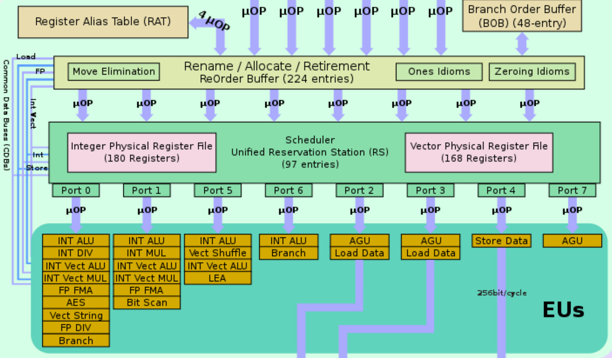
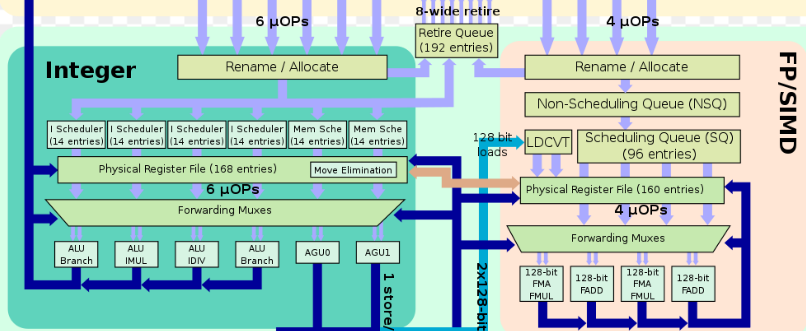

# Architecture

??? note "Version History"
	|Date|Description|
	|:---|-----------|
	|Dec 30, 2020| Initial|

:sailboat:
:sailboat:
:sailboat:

This is my personal notes on architecture related topics.
There is a separate blog on [cache coherence](./cache_coherence.md).

## Reservation Station and ROB

They serve different purposes. ROB can not replace reservation station.
ROB records all instructions and their control information, their order.

An instruction will alloc an ROB entry alive when it enters execution enegine
and free the entry when it finally able to commit.

An instruction will alloc an reservation station entry when it enters execution
engine, just like ROB. But it will free the entry when the functional unit
finished execution. Essentially, the ROB entry outlives the reservation station entry.

This is why the number of ROB entries is larger than the number of reservation
station entries. E.g., in Skylake, there are 224 ROB entries, and 97 reservation
static entries.

One thing I notice is that there is still a Comman Data Bus (CDB)
connecting the output of execution engines to the reservation station
and ROB. [Image](https://en.wikichip.org/wiki/File:skylake_block_diagram.svg)

## Physical Register Files and ROB

When we add speculation to traditional Tomasulo,
we will add a ROB table. Each entry in ROB
has an attached buffer. Like reservation station (RS),
ROB can also store and forward results.

Physical register file is a separate unit.
With it, the ROB no longer needs to store/forward data.
We only need a renaming table to manage the mapping.

The benefit of using a separate physical register file
over ROB-with-buffer is that we can greatly reduce data movement.
The ROB no longer needs write back data to register file, it
will be stored when the computing unit produces it.

## Distributed v.s. Centralized Reservation Station

Textbook Tomasulo uses **distributed reservation station**,
each functional unit has its own attached RS entries.
Some old CPUs like PowerPC 604, Pentium 4 and newer generation CPUs like [AMD Zen](https://en.wikichip.org/wiki/File:zen_block_diagram.svg)
series are also using distributed reservation station.

Regarding AMD Zen, the [architecture figure](https://en.wikichip.org/wiki/File:zen_block_diagram.svg)
shows there are 6 small schedulers within the Integer execution pipeline,
each with 14 entries, so in total 84 entries.
It appears each scheduler is used exclusively by one execution port,
but the `forwarding muxes` below confuses me.
This mux maybe able to distribute
work across different ports thereby overtime
resource fragmentation issue of distributed reservation station approach?
Not sure how exactly it is designed.

On the contray, recent Intel CPUs are all using **centralized reservation station** design.
There is one giant unified reservation station, or scheduler in Intel's wording,
working for all functional units. E.g., in [Skylake](https://en.wikichip.org/wiki/File:skylake_block_diagram.svg), this scheduler has 96 entries,
meaning there can be 96 instructions currently being executed by functional units
(The number of ROB entries is larger than this number, because ROB still cache info for already excuted but uncommitted instructions).

I don't really know the actual practical trade-off among these two choices.
My guess for centralized v.s. distributed reservation station trade-offs are:

1. For centralized design, the RS is not statically partitioned like the
distributed design. So the RS usage can adapt to workloads to avoid some blocking.
2. Centralized design for sure has more complex control logic and more challenging
to implement!

**Centralized Reservation Station (Intel Skylake):**

**Distributed Reservation Station (AMD Zen):**

## References

1. Intel optimization manual
2. Wikichips
3. Agner Fog's optimization manuals (the microarchitecture one)
