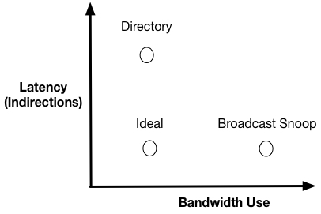

# Practical Cache Coherence

??? note "Version History"
	|Date|Description|
	|:---|-----------|
	|Jul 2, 2021| add implication discussion|
	|Feb 24, 2020| Kobe and Gigi. Add Intel CCIP. |
	|Oct 3, 2019| Add FPGA related discussion|
	|Jun 28, 2019| Initial draft|

:sake:

- [Practical Cache Coherence](#practical-cache-coherence)
  - [Summary and Thoughs](#summary-and-thoughs)
    - [Implication for Synchronization](#implication-for-synchronization)
    - [Implication for On-Chip Bandwidth and NUMA](#implication-for-on-chip-bandwidth-and-numa)
  - [Readings](#readings)
  - [Case Study](#case-study)
    - [Intel](#intel)
    - [AMD](#amd)
    - [ARM](#arm)
    - [OpenCAPI and CCIX](#opencapi-and-ccix)
    - [CXL](#CXL)
    - [OpenPiton](#openpiton)
    - [FPGA](#fpga)
    - [Formal Verification](#formal-verification)

TL;DR.
This is a note on how cache coherence protocols are implemented in real hardware.
This note is NOT just about acadamic new ideas.

I started this when I was having a hard time optimizing `lock delegation`,
which relies on fine-tuning cache coherence to achieve extremely fast locks.

## Summary and Thoughs

The textbooks tough us the basic concept of MESI. And specific algorithms
like _snoop_ and _directory._ What usually missing is the implementation
details when it comes to: 1) how to solve conflicts, 2) what if there is no single shared bus.

Modern processors have _Network-on-Chip (NoC)_.
Within the die, cores, cache slices (large LLC is usually divided into slices),
memory controllers and other components are connected via
an on-chip network (e.g., a ring in old-generation Xeon, or a mesh in Xeon Scalable).
This architecture is no different from connecting a set of distributed servers.
The NoC has its own protocol (I guess ranging from L1 to L3, must be reliable data delivery).
And all on-chip components communicate by sending/receiving packets.
There is no central coordinator.

_What this means for cache coherence?_

Cache requests generated by MESI protocols should appear __atomic__ to requesting cores.
Given the distributed nature of all resources (via NoC), those cache requests
are implemented like __distributed transactions__!
This brings great complexity to a performant and correct cache coherence implementation.
Hardware is much much faster than a set of distributed nodes. Besides, it cannot
implement arbitrary logic, whatever protocol they design has a tight time budget.

For example, Intel uses the MESIF cache coherence protocol.
In their implementation,
when a core made a _read_ to an invalid line, the corresponding cache
will perform a _cache read transaction_ to get the data from
either other caches or memory. This transaction consists of multiple
steps, such as: send requests, collect responses, and finally send ACKs.

Those transactions will conflict if multiple reads and writes
happen at the same time. __Someone has to resolve it__.
It can be resolved by different cache controllers, or by a single
serialization point like home agent.

Just like you can have many ways to implement transactions
for distributed systems, there are also many ways to do
cache coherence transactions. And there are many.

Atomic Read-Modify-Write (RMW) instructions will make cache coherence
implementations even more complex. Those instructions include
`read-and-inc`, `test-and-set`, and `lock; `-prefixed.
I think, there will some "lock the bus", or "locked state" at the
home agent per cache line. Having atomic RMW instructions
will add more complexity to the overall transaction design.

While reading Intel related cache coherence diagrams/transactions,
you might find many different descriptions. Don't panic. They are
just different implementations proposed by Intel. Different
implementations will have different trade-offs and performance,
you can check [Frank's post](https://frankdenneman.nl/2016/07/11/numa-deep-dive-part-3-cache-coherency/)
for more details.

Directory-based cache coherence protocol and implementation will
be the future for multicore machines. Because it incurs much less
coherence traffic than snoop-based ones, thus more scalable.
The trend is confirmed by recent Intel UPI directory-based approach.
Related readings:
  - [1]: [Why On-Chip Cache Coherence Is Here to Stay](http://www.cis.upenn.edu/acg/papers/cacm12_why_coherence.pdf)
  - [2]: [QPI 1.1 Invovled](https://www.realworldtech.com/qpi-evolved/3/)
  - [3]: [Paper: Multicast Snooping: A New Coherence Method Using a Multicast Address Network, ISCA '99](http://research.cs.wisc.edu/multifacet/papers/isca99_multicast_talk_pdf.pdf)
  - [4]: [Paper: Using Destination-Set Prediction to Improve the Latency/Bandwidth Tradeoff in Shared-Memory Multiprocessors, ISCA'03](https://www.cis.upenn.edu/~milom/papers/isca03_destination_set_prediction.pdf)
  - [5]: The trade-off: 

Left questions:
- Do cache coherence implementations ensure __fairness__ among cores?

### Implication for Synchronization

Synchronization code (e.g., locking code) has deep relation with cache coherence and memory consistency.
A lot optimizations are playing with certain cache coherence protocols.
For example, a locking primitive may want to first read the lock then try to atomically change its
value. By doing so, the first read will not trigger any cache invalidation to other cores, hence
save latency and on-chip bandwidth.

As for memory consistency, it affects how many barriers should be inserted
and whether a release/acquire semantic should be used.

Anyway, if you are implementing synchronization primitive, pay attention to cache coherence.
Read the
[discussion](https://software.intel.com/en-us/forums/intel-moderncode-for-parallel-architectures/topic/700477)
posted by Dr. Bandwidth, especially this one on
[cache coherence flows on a procuder-consumer case](http://lastweek.io/pubs/misc/dr-bandwidth-core2core-cache-coherence-explain.pdf).
It is very useful if you are trying to implement high-performance spinlocks and concurrency data structures.

### Implication for On-Chip Bandwidth and NUMA

Cache coherence consumes a LOT on-chip bandwidth.
Think about all the messages it will send for a single transation.
And this transaction can be easily triggered by normal read/write.
So the cache coherent protocol end up using a lot on-chip bandwidth.

This is problematic for two reasons:
a) the NoC bus/ring is shared. It will affect other traffic hence performance.
b) In a NUMA architecture, the interconnection between CPU dies is responsible for a lot things
like data transfer, cache coherence traffic, and other misc traffic. If cache coherence uses
a lot, there is little room for others.

Many have complained this.

So what's the mitigation?
The first try is to move from Snoop to Directory so to avoid excessive traffic.
Some sort of centralized coordinator could resolve conflicts therefore save tons of traffic.
Intel's cache coherence protocol has involved for this direction as well.
Other measures? I don't know.

## Readings

- [The Architecture of the Nehalem Processor and Nehalem-EP SMP Platforms](http://citeseerx.ist.psu.edu/viewdoc/download?doi=10.1.1.455.4198&rep=rep1&type=pdf), chapter 5.2 Cache-Coherence Protocol for Multi-Processors.
- [Intel: Performance Analysis Guide for Intel® Core™ i7 Processor and Intel® Xeon™ 5500 processors](https://software.intel.com/sites/products/collateral/hpc/vtune/performance_analysis_guide.pdf)
- [Dr.Bandwidth on Core2Core cache coherence flows when running producer-consumer type of workload.](http://lastweek.io/pubs/misc/dr-bandwidth-core2core-cache-coherence-explain.pdf). 100% recommended.
- [Blog: NUMA Deep Dive Part 3: Cache Coherency](https://frankdenneman.nl/2016/07/11/numa-deep-dive-part-3-cache-coherency/)
    - The BEST blog I've seen on the topic of `Intel snoop models`.
    - Intel is using MESIF cache coherence protocol, but it has multiple cache coherence implementations.
      The first one is `Source Snoop` (or `Early Snoop`), which is more like a traditional snoop-based
      cache coherence implementation. Upon miss, the caching agent will broadcast to other agents.
      The second one is `Home Snoop`, which is more like a directory-based cache coherence implementation.
      Upon miss, the caching agent will contact home agent, and then the home agent will send requests
      to other caching agents who have the requested cache line.
      There are other implementations like Cluster-on-Die.
      Intel UPI gets rid of all this complexity, it is only using directory-based, in the hope to reduce
      cache coherence traffic, which make sense.
    - Related: [Broadwell EP Snoop Models](https://software.intel.com/en-us/articles/intel-xeon-processor-e5-2600-v4-product-family-technical-overview)
    - Related: [Skylay UPI](https://software.intel.com/en-us/articles/intel-xeon-processor-scalable-family-technical-overview)
- [Paper: MESIF: A Two-Hop Cache Coherency Protocol for Point-to-Point Interconnects (2009)__](https://researchspace.auckland.ac.nz/bitstream/handle/2292/11594/MESIF-2009.pdf?sequence=6)
    - A MUST read.
    - This paper has the most extensive description of the MESIF protocol implementation.
      It has many `timing diagrams` than describe how cache requests actually proceed.
      Those diagrams can help us understand what is needed to finish a cache request.
    - Their [slides](https://parlab.eecs.berkeley.edu/sites/all/parlab/files/20091029-goodman-ssccp.pdf)
      has more timing diagrams.
    - But do note: the implementation described by this paper is different from
      what [Intel QPI](https://www.intel.ca/content/dam/doc/white-paper/quick-path-interconnect-introduction-paper.pdf)
      has in products. The difference is discussed at chapter 4. MESIF and QPI, namely,
      other caching agents will send responses to Home agent rather than to requesting agent.
      QPI relies on Home agent to solve conflict.
    - Also note: this is just one of the possible implementations to realize MESIF protocol.
      There could be many other ways, e.g., QPI source snooping, QPI home snooping.
      But all of them share the essential and general concepts and ideas.
- [Appendix I: Large-Scale Multiprocessors and Scientific Applications](https://www.elsevier.com/books-and-journals/book-companion/9780128119051),
  chapter 7 Implementing Cache Coherence.
    - This is probably some most insightful discussion about real implementation of cache coherence.
      With the distributed nature and Network-on-Chip, implementing cache coherence in modern
      processors is no different than implementing a distributed transaction protocol.
    - Cache activities like read miss or write miss have multi-step operations, but they
      need to appear as "atomic" to users. Put in another way, misses are like transactions,
      they have multiple steps but they must be atomic. They can be retried.
    - Having directory for cache coherence will make implementation easier. Because
      the place (e.g., L3) where directory resides can serve as the serialization point.
      They can solve write races.
    - `Home directory controller` and `cache controller` will exchange messages like a set of distributed machines.
      In fact, with NoC, they are actually distributed system.
- [Intel: An Introduction to the Intel® QuickPath Interconnect](https://www.intel.ca/content/dam/doc/white-paper/quick-path-interconnect-introduction-paper.pdf),
  page 15 MESIF.
      - [HotChips slide](https://www.hotchips.org/wp-content/uploads/hc_archives/hc21/1_sun/HC21.23.1.SystemInterconnectTutorial-Epub/HC21.23.120.Safranek-Intel-QPI.pdf), has timing diagrams.
      - It explains the `Home Snoop` and `Source Snoop` used by Intel.
      - Based on their explanation, it seems both `Home Snoop` and `Source Snoop` are using a combination of
        snoop and directory. The Processor#4 (pg 17 and 18) maintains the directory.
      - And this is a perfect demonstration of the details described in [Appendix I: Large-Scale Multiprocessors and Scientific Applications](https://www.elsevier.com/books-and-journals/book-companion/9780128119051).
      - Related patent: [Extending a cache coherency snoop broadcast protocol with directory information](https://patents.google.com/patent/US20150081977)
- [Paper: Multicast Snooping: A New Coherence Method Using a Multicast Address Network, ISCA '99](http://research.cs.wisc.edu/multifacet/papers/isca99_multicast_talk_pdf.pdf)
    - A hybrid snoop and directory cache coherence implementation. The insight is snoop
      cause too much bandwidth, directory incurs longer latency.
    - So this paper proposed `Multicast snoop`, where it multicasts coherence transactions
      to selected processors, lowering the address bandwidth required for snooping.
- [Paper: Why On-Chip Cache Coherence Is Here to Stay, Communications of ACM'02](http://www.cis.upenn.edu/acg/papers/cacm12_why_coherence.pdf)
    - This paper discusses why cache coherence can scale. A nice read.
    - R1: Coherence’s interconnection network traffic per miss scales
          when precisely tracking sharers. (Okay increased directory bits,
	  what about those storage cost? See R2).
    - R2: Hierarchy combined with inclusion enables efficient scaling
          of the storage cost for exact encoding of sharers.
    - R3: private evictions should send explicit messages to shared cache
          to enable precise tracking. Thus the recall (_back invalidation_) traffic can be
	  reduced when shared cache is evicting (assume inclusion cache).
    - R4: Latencies of cache request can be amortized.
- [Book: Parallel Computer Organization and Design](https://www.amazon.com/Parallel-Computer-Organization-Design-Professor/dp/0521886759), Chapter 7.
    - Links coherence and consistency together. This chapter uses detailed graphs to show
      how different cache coherence implementations affect consistency.
- [Book: A Primer on Memory Consistency and Cache Coherence](http://citeseerx.ist.psu.edu/viewdoc/download?doi=10.1.1.225.9278&rep=rep1&type=pdf)
    - Best book for this topic.
- [Dr.Bandwidth on explaining core-to-core communication transactions!](https://software.intel.com/en-us/forums/intel-moderncode-for-parallel-architectures/topic/700477)
    - Seriously, it's so good!
    - Although, I just feel there are so many unpublished details about the exact coherence transactions.
      Dr.Bandwidth himself used a lot "maybe", and listed possible actions.
- [Transactional Memory Coherence and Consistency, ISCA'04](http://www.mavam.com/lance/publications/tcc_ISCA04.pdf)
- [Programming with Transactional Coherence and Consistency (TCC)](http://www.mavam.com/lance/publications/tcc_ASPLOS04.pdf)
    - [Slide1](http://www.mavam.com/lance/publications/tcc_ASPLOS04Talk.pdf)
    - Awarded the most influential paper at ISCA 2019. I took a read today (Jul 21, 2019).
    - I feels like it's using the "batch" optimization for all time. The TCC design,
      kind of combines both cache coherence and memory consistency: how transactions
      commit or orders, determins the coherence and consistency.
    - It seems the load/store speculative execution used in their context is so similar
      to what Dr.Bandwidth said about Intel's implementation. Basically, the processor
      might read some data from L1/L2 and continue execution, but there is a chance,
      that the data is modifed by others, and the L3 caching agent or home agent
      could decide to revoke it. Once receiving such revoke message,
      the processor must cancel all executions that use the speculatively read data. 
    - It mentions couple Thread-Level Speculation papers, I think they should on this topic.

## Case Study

### Intel

**Misc Facts.**

- Intel Caching Agent (Cbox) is per core (or per LLC slice). Intel Home Agent is per memory controller.
    - "The LLC coherence engine (CBo) manages the interface between the core and the last
level cache (LLC). All core transactions that access the LLC are directed from the core
to a CBo via the ring interconnect. The CBo is responsible for managing data delivery
from the LLC to the requesting core. It is also responsible for maintaining coherence
between the cores within the socket that share the LLC; generating snoops and
collecting snoop responses from the local cores when the MESIF protocol requires it."
    - "Every physical memory address in the system is uniquely associated with a single Cbox
      instance via a proprietary hashing algorithm that is designed to keep the distribution of
      traffic across the CBox instances relatively uniform for a wide range of possible address patterns."
    - Read more [here, chapter 2.3](https://www.intel.com/content/dam/www/public/us/en/documents/manuals/xeon-e5-2600-v2-uncore-manual.pdf).
    - Starting from Intel UPI, Caching Agent and Home Agent are combined as CHA.
- A good [discussion](https://www.realworldtech.com/qpi-evolved/3/) about why QPI gradually drop `Source Snoop` and solely use `Home Snoop`.
    - The motivation is scalability. It turns out the new UPI only supports directory-based protocol.
    - This makes sense because 1) inter socket bandwidth is precious, 2) snoop will consume a lot bandwidth.
- Intel UPI is using directory-based home snoop coherency protocol
    - [Intel® Xeon® Processor Scalable Family Technical Overview](https://software.intel.com/en-us/articles/intel-xeon-processor-scalable-family-technical-overview)
- To provide sufficient bandwidth, shared caches are typically interleaved
  by addresses with banks physically distributed across the chip.

**A Transaction Breakdown.**

Intel does not disclose too much details about their cache coherence implementations.
The most valuable information is extracted from uncore PMU manuals, and discussions
from Dr. Bandwidth. According to Dr. Bandwidth, the Intel CPU could dynamically
adapt its coherence strategy during runtime according to workload. There won't
be one fixed cache coherence implementation, there will be many. It depends on
workload which one is used at runtime.

What happens when a core tries to access a cache line?
A detailed cache protocl breakdown derived from Dr.Bandwidth's comment.

- Physical addresses are uniquely hashed into L3 slices. That means each individual
  physical address belongs to a L3 slice, and also belongs to a home agent.
- Upon L2 miss, it will send requests to corresponding L3 slice. If the L3 slice
  is in the local socket, the request can be delievered within the same socket.
  If the L3 slice belongs to another remote socket, the L2 miss request will
  be sent over QPI/UPI. Also note that the L2 controller will not send snoop requests.
  (This is answering the question of "why using local memory is faster than remote"
   from the cache coherence perspective.)
- At L3, when received the request from a L2,
    - If it's in source snoop model, it will send `snoop messages` to other sockets.
    - If it's in home snoop model, it will send `read message` to other sockets.
      The another socket will generate snoop and collect responses. (R3QPI or home?)
    - Quote Dr. Bandwidth: Maintaining consistency is easier if the data is sent
      to the L3 first, and then to the requesting core, but it is also possible to
      send to both at the same time (e.g., "Direct2Core"). In recent processors,
      these return paths are chosen dynamically based on undocumented states and
      settings of the processor.
    - I'm not sure who will ACK L2 at last. L3 or home agent? Both are possible.
- I think both L3 and home agent have directory information. They know where
  to send snoop/read messages. And both of them can serialize coherence transactions!
  It's just undocumented who is doing what.
- In generall, we need to bear the fact that we cannot just figure out how Intel
  cache coherence works underlying. We maybe just need to "vaguely" know the fact that:
    - Both directory and snoop will be used in combination.
    - L3/home agent will serialize conflicting transactions
    - L3/home agent will send data to requesting core
    - L3/home agent will send final ACK to requesting L2
    - A coherence transaction is a multi-step distributed transaction.
      It involes sending requests, serialize conflicts, receiving responses/ACKs.

Read the [discussion](https://software.intel.com/en-us/forums/intel-moderncode-for-parallel-architectures/topic/700477) posted by Dr. Bandwidth,
especially this one on detailed [cache coherence flows on a procuder-consumer case](http://lastweek.io/pubs/misc/dr-bandwidth-core2core-cache-coherence-explain.pdf), which is essential if you are trying to implement high-performance spinlocks and concurrency data structures.

### AMD

- AMD HyperTransport Assit for Cache Coherence
    - [Slide](https://www.hotchips.org/wp-content/uploads/hc_archives/hc14/3_Tue/28_AMD_Hammer_MP_HC_v8.pdf)
    - [Slide](http://www.hotchips.org/wp-content/uploads/hc_archives/hc21/2_mon/HC21.24.100.ServerSystemsI-Epub/HC21.24.110.Conway-AMD-Magny-Cours.pdf)

### ARM

- [AMBA CHI Specifications](https://developer.arm.com/architectures/system-architectures/amba/documentation?_ga=2.147594999.1797165765.1562530195-129127748.1561485892)
    - This is probabaly the most comprehensive document I've ever seen about cache coherence.
      Although terms used by ARM differs from the ones used by Intel, still, you can map them.
      Chapter 5 Interconnect Protocol Flows has a lot timing diagrams regarding read/write/atomic
      coherence transactions.
    - It's a good reference to know, but it would be hard to actually understand the details.

### OpenCAPI and CCIX

- [CCIX White Paper](https://docs.wixstatic.com/ugd/0c1418_c6d7ec2210ae47f99f58042df0006c3d.pdf)
- [OpenCAPI]()

### CXL

Like OpenCAPI and CCIX, it builds on top of PCIe.
It is intra-server cache coherence protocol.

Not very exciting to me. But it does receive some spotlight recently.

### OpenPiton

- [OpenPiton Microarchitecture Specification](https://parallel.princeton.edu/openpiton/docs/micro_arch.pdf)
    - Directory-based MESI
    - This spec has detailed coherence message packet format and type. Unfortunately,
      it does not say anything about how they deal with coherence transaction conflicts.
      E.g., some timeline diagrams like Figrue 2/3 in this [paper](https://researchspace.auckland.ac.nz/bitstream/handle/2292/11594/MESIF-2009.pdf?sequence=6).
- BYOC: A "Bring Your Own Core" Framework for Heterogeneous-ISA Research, ASPLOS'20

### FPGA

- Analysis and Optimization of I/O Cache Coherency Strategies for SoC-FPGA Device, FPL'19
- LEAP Shared Memories: Automating the Construction of FPGA Coherent Memories, FCCM'14.
    - This work is built on their earlier work, which basically add the data caching
      concept to FPGA: using BRAM as L1, on-board DRAM as L2, host or remote DRAM as L3.
    - In their earlier work, each FPGA application (or bitstream) has a private L1 cache.
    - In this work, the add MESI coherence to these private L1 caches, as in they can make
      multiple L1 cache cache-coherent.
    - The techniques and protocols from this paper are similar to the exisiting ones. For example,
      1) they use a global serializing point to serialize transactions, 2) they designed a lot
      messaging types such as INV, RESP and so on.
- [VMware Research Project PBerry](https://research.vmware.com/publications/project-pberry-fpga-acceleration-for-remote-memory)
    - A very interesting and promising project.
    - They have this follow up work "Rethinking software runtimes for disaggregated memory, ASPLOS'21".
      But it is simulation using the HotOS paper idea. The real FPGA has not been built yet.
      They need to know Intel's protocol to build it, which is.. impossible?
      I think it is probably better to use RISC-V.
- [Intel FPGA PAC](https://www.intel.com/content/www/us/en/programmable/documentation/bfr1522087299048.html)
    - Intel itself is building a FPGA-CPU cache coherent setting. They use the Intel UPI interconnect
      to natually the spectrum. The FPGA shell has some modules to handle this.
- [Intel FPGA CCIP](https://www.intel.com/content/dam/www/programmable/us/en/pdfs/literature/manual/mnl-ias-ccip.pdf)
    - Maybe the ASPLOS'20 Optimus paper is uing CCIP-related research platform?

- Also some pointer chasing related stuff
	- [A Study of Pointer-Chasing Performance on Shared-Memory Processor-FPGA Systems, FPGA'16](https://users.ece.cmu.edu/~jhoe/distribution/2016/fpga16.pdf)

### Formal Verification

I remember there are couple works from Princiton doing cache protocol verification.
