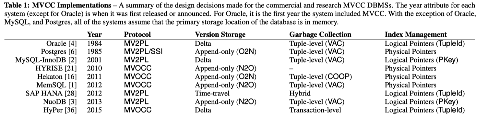
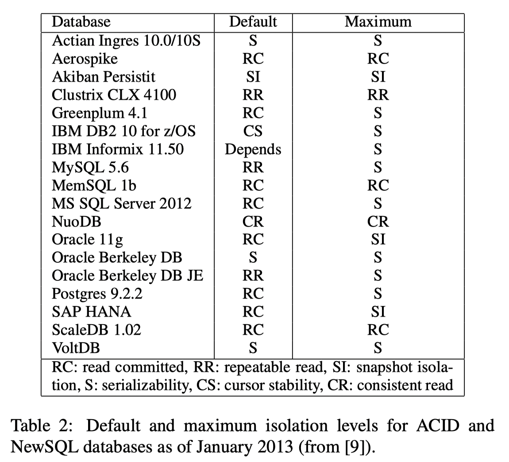
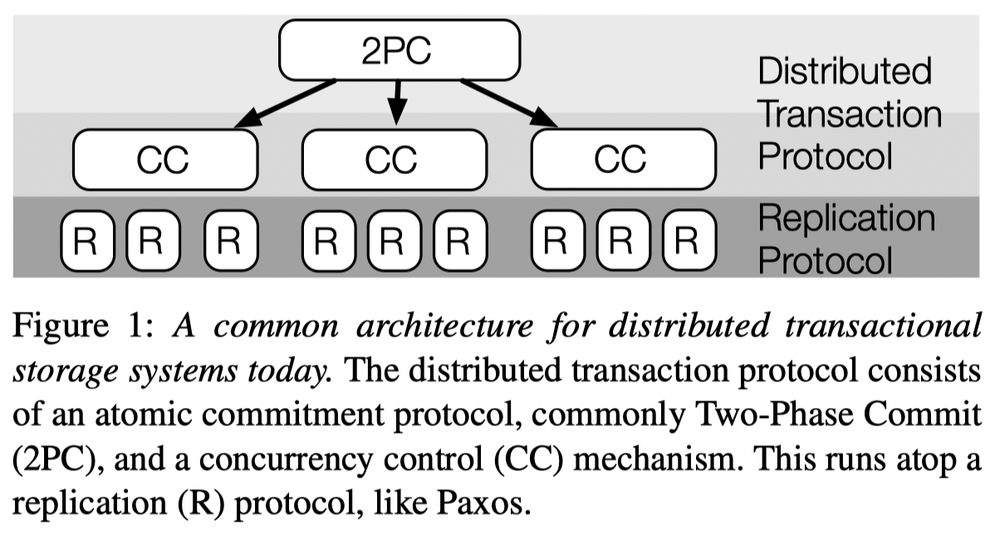
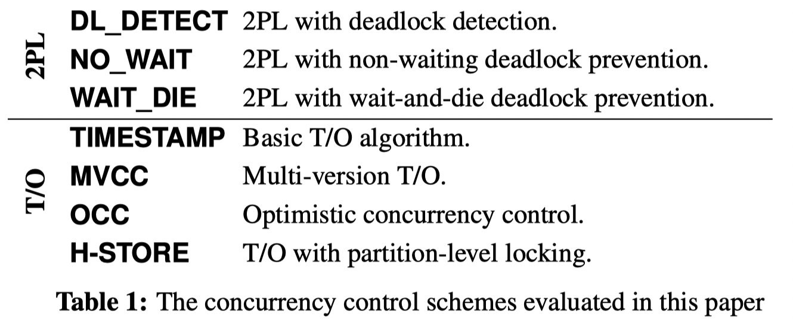
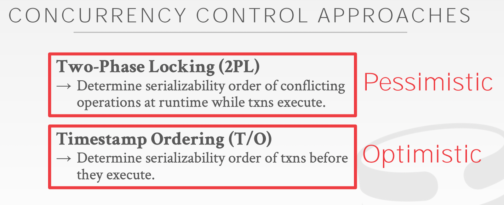
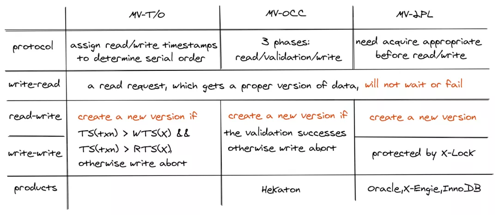

# Distributed Transactions and Databases

??? note "Version History"
	|Date|Description|
	|:---|-----------|
	|Feb 25, 2022| Initial|

:sailboat:

This note was originally written in this [google doc](https://docs.google.com/document/d/1uziWg4Ca-0-MVf8ehD-cJnDqNkpzxjhj-I5Pu2Civ7A/edit?usp=sharing).
This note was my attempt to revive the distributed transaction topic and to get
a better understanding about database systems in general.
The end result is quite fruitful, I covered various concurrency control schemes,
isolation levels, and so on. The consensus protocols, query optimizations etc topics are not extensively discussed here.

## Why I started this note

My knowledge about distributed transactions and stuff starts from my first project, Hotpot (2017). However, during these 5 years, my knowledge in this area kind of stagnated. I haven’t done any serious distributed systems since Hotpot. Although LegoOS, Clio, and SuperNIC are all distributed systems, they don’t touch any of these serious concepts.

Today 02/16/2022, I’m reading the  [FORD, FAST’22](https://www.usenix.org/conference/fast22/presentation/zhang-ming)  paper, they are designing distributed transactions for disaggregated persistent memory, they talked about OCC, 2PL, primary-backup etc schemes, and I decided to take another serious look at this topic. I still have the vivid memory of me reading some old Transaction-related surveys (after the ZooKeeper paper) in a small, smelly, broken Purdue ECE room when I first started my PhD. I also had a vivid memory of a meeting among myself, Yiying, Stanko, Marcus in a VMR office room. We were talking about OCC, MVCC, and the then upcoming OSDI’18 hybrid transaction paper. I was confused. Anyways, let’s revive this topic.

## Papers and Readings

 [01 Papers - ALL](https://docs.google.com/spreadsheets/d/1JODWoEtDBxeOTr-ZqEqm3D-9wfADyNqgMoIOSpukBL0/edit#gid=266644662)   - there is a TAB dedicated to Distributed Transaction related papers.

**Courses**

*  [Schedule | CMU 15-445/645 :: Intro to Database Systems (Fall 2019)](https://15445.courses.cs.cmu.edu/fall2019/schedule.html) 
	* This is DBMS basics, good start. 
*  [Schedule - CMU 15-721 :: Advanced Database Systems (Spring 2020)](https://15721.courses.cs.cmu.edu/spring2020/schedule.html)  
	* This is more advanced paper reading.

**General Readings**

*  [Zotero Paper Collection](https://www.zotero.org/lastweek/collections/6GHIQ7E8) 
*  [http://www.redbook.io/](http://www.redbook.io/)  The famous Red Book
*  [theanalyst/awesome-distributed-systems](https://github.com/theanalyst/awesome-distributed-systems)   - Github Awesome List
*  [Distributed Systems Reading List](https://dancres.github.io/Pages/)   - Reading List

**Good Readings**

*  [Time, Clocks, and the Ordering of Events in a Distributed System, 1978](https://lamport.azurewebsites.net/pubs/time-clocks.pdf)  - classical
*  [On Optimistic Methods for Concurrency Control, 1981](https://www.eecs.harvard.edu/~htk/publication/1981-tods-kung-robinson.pdf) 
	* First paper proposing OCC, definitely a seminal paper.
*  [Concurrency Control in Distributed Database Systems](https://people.eecs.berkeley.edu/~brewer/cs262/concurrency-distributed-databases.pdf) , 1981
	* This paper categorizes 2PL, MVCC, OCC etc into 2 big types.
	* The CMU slides/papers use this categorization to this date.
*  [Linearizability: a correctness condition for concurrent objects](https://dl.acm.org/doi/abs/10.1145/78969.78972) , 1990 
*  [An Evaluation of Concurrency Control with One Thousand Cores, VLDB’14](https://www.vldb.org/pvldb/vol8/p209-yu.pdf) 
	* A good read on comparing various concurrency control schemes.
	* Note that the MVCC mentioned in this paper is MVTO.
*  [An Empirical Evaluation of In-Memory Multi-Version Concurrency Control, VLDB’17](https://www.vldb.org/pvldb/vol10/p781-Wu.pdf) 
	* This is a really good read and should be read in great detail.
	* Understand that OCC’s core is to reduce the critical section time. And MVCC is not a concurrency control method on its own, it merely enables multiple versions of the same object/tuple. Hence MVCC could work with any concurrency control methods, resulting in combos like MVTO, MVOCC, MV2PL.
*  [An Evaluation of Distributed Concurrency Control, VLDB’17](https://www.vldb.org/pvldb/vol10/p553-harding.pdf) 
	* This read reminds us the default Isolation level out in the wild is usually not serializability, but something weaker like Snapshot Isolation, or Read Committed.

## Concepts

### Summary

MVCC is prevalent as the default implementation choice, for its better performance on read transactions. It is coupled with a concurrency control, resulting in sth like MVTO, MVOCC, MV2PL. Essentially, MVCC is the de-facto choice for modern DBMS for its better performance regarding read/write transactions. See the MVCC section for more details.

The following image shows the commercial/research use of MVCC DBMS.

For isolation level, the serializable isolation is usually NOT the default option used by commercial DBMS systems. For better performance, the default one is usually Snapshot Isolation, or Read Committed. It is baffling to accept the fact that many real world systems are operating under a weak consistency model and we are actually okay with it! See the Isolation section for more details.

The following image shows the default Isolation level used by various systems. A bit old image from a VLDB’13 paper.

### Misc

#### *2PC v.s. 2PL*

2-phase locking
 [2-phase commit](https://en.wikipedia.org/wiki/Two-phase_commit_protocol) 
 [3-phase commit](https://en.wikipedia.org/wiki/Three-phase_commit_protocol) 

> The two-phase commit (2PC) protocol should not be confused with the  [two-phase locking](https://en.wikipedia.org/wiki/Two-phase_locking)  (2PL) protocol, a  [concurrency control](https://en.wikipedia.org/wiki/Concurrency_control)  protocol.  

[*NOTE: the description about OCC, MVCC, 2PL might be wrong. I had the wrong impression about them. But now I understand after reading the VLDB’17 paper. I believe the MVCC below can be thought of as MVCC-TO, or MVTO.*]

Concurrency control methods such as 2PL, T/O(OCC, MVCC-TO, T/O) etc methods are used to ensure concurrent operations to shared data are serialized, hence ensuring serializability and data consistency. Their mechanisms ensure operations such as read/write are ordered properly.  These mechanisms can be used both within a single machine or across nodes. (The  [An Evaluation of Concurrency Control with One Thousand Cores, VLDB’04](https://www.vldb.org/pvldb/vol8/p209-yu.pdf)  paper evaluates several Concurrency Control methods within a single machine).

Problem arises when going to multiple nodes: they cannot ensure whether the transaction commits at all participating nodes, some may have committed, some may have not - and this creates an inconsistent state. Use 2PL as an example: in 2PL, we first grab all locks across all involving nodes, we then run the execution/logic locally on a node, we finally send all the new data (if any) to other nodes and release the locks. In the last step, there is no way for us to make sure that all participating nodes have received the message. If only some of them finalized/committed the transaction, then the whole database/system is in an inconsistent state.

This is where  [atomic commit protocol](https://en.wikipedia.org/wiki/Atomic_commit)  such as  [2-phase commit](https://en.wikipedia.org/wiki/Two-phase_commit_protocol)  comes in. It ensures that all participants either all commit or none of them commits the transaction. It does so by using another 2-phase protocol: prepare + commit. It is easy to understand. There are more complicated methods such as 3PC or Paxos Commit.

I think my original confusion about 2PC and 2PL stems from my illusion that we can use 2PL to also implement what 2PC desires to achieve. But after the above reasoning, I realize that is not possible. 2PC and 2PL have very clear distinctions. I also had a misconception that 2PC is needed because it can ensure durability. This is also false because 2PC is required simply to ensure atomic commit, for both w/ or w/o durability guarantee. If we want durability, then 2PC’s participants would need to either do local logging or build on top of a replication mechanism such as Paxos.

A short summary:

* Concurrency control methods include 2PL, OCC, MVCC, T/O etc algorithms.
* Atomic commit methods include 2PC, 2PC, paxos-commit
* Concurrency control methods can work in a single machine or across machines
* Once concurrency control goes distributed, it requires atomic commit to ensure consistency
* 2PL + 2PC, OCC + 2PC, MVCC + 2PC etc are concurrency control + atomic commit
* Atomic commit can include or exclude durability guarantee

#### *Scenarios and Hardware*

One key thing worth considering is the operating environment.
Some systems like Spanner target geo-distributed data centers, which could go though low-latency WAN.

#### *Bottlenecks*

Many papers and systems have mentioned that the global timestamp allocation is a major bottleneck in Timestamp Ordering concurrency control systems (including OCC and MVCC).  This is easy to understand: having some sort of global data structure that increases monotonically is hard in a distributed setting. I think that’s why several systems (Spanner, FaRMv2) resort to proactively dealing with clock uncertainties. 

#### In-memory v.s. Disk-base DBMS
XXX

#### Self-Driving DBMS

Essentially uses ML to make some decisions?

Readings:

*  [Self-Driving Database Management Systems](https://db.cs.cmu.edu/papers/2017/p42-pavlo-cidr17.pdf) , CIDR’17 
*  [Automatic Database Management System Tuning Through Large-scale Machine Learning](https://dl.acm.org/doi/pdf/10.1145/3035918.3064029)  

### *Integrate Distributed Transaction and Replication*

(image from TAPIR, SOSP’15)

I think the traditional DBMS systems design distributed transactions and replication as two different things. For example, the dist-xact could be sth like 2PL+2PC, or OCC+2PC. Below the dist-xact, lies the replication protocol such as Primary-Backup replication, Paxos, Raft.

In the google spanner, they use 2PL+2PC for distributed transactions, which is layered on top of Paxos. A set of machines form a Paxos group. Each paxos group has a leader. This leader is sort of the transaction manager for its Paxos group. If there is a distributed transaction that touches multiple such Paxos groups, their leaders will run 2PL+2PC among them; leaders run Paxos within the Paxos group. This layering is good for modularization but at the cost of more data/messages exchanged. 

It results in **over-coordination**.

It is a natural thought to **co-design dist-xact and replication** (reliability). For instance, in the FaRM, SOSP’15 paper, they describe the co-designed four-phase protocol (lock, validation, commit-backup, commit-primary). 

Related work in this space

* **Hotpot, SoCC’17**co-designs distributed transaction and replication in its MRSW and MRMW protocols (which are 2PL+2PC, and OCC+2PC, respectively)
* **FaRMv1, SOSP’15 & NSDI’14** co-designs distributed transaction and replication in one 4-phase protocol, using RDMA
* FaRMv2, SIGMOD’19
*  [TAPIR, SOSP’15](https://irenezhang.net/papers/tapir-sosp15.pdf) 
* [FORD: Fast One-sided RDMA-based Distributed Transactions for Disaggregated Persistent Memory, FAST'22]()

### Concurrency Control

Pessimistic Concurrency Control
Optimistic Concurrency Control 

Must Read

* *  [Concurrency Control in Distributed Database Systems](https://people.eecs.berkeley.edu/~brewer/cs262/concurrency-distributed-databases.pdf) , 1981
	* This paper categorizes 2PL, MVCC, OCC etc into 2 big types.
	* Must read. Seminal Paper.
*  [On Optimistic Methods for Concurrency Control, 1981](https://www.eecs.harvard.edu/~htk/publication/1981-tods-kung-robinson.pdf)  - first OCC paper 
*  [An Evaluation of Concurrency Control with One Thousand Cores, VLDB’14](https://www.vldb.org/pvldb/vol8/p209-yu.pdf) 
	* This CMU paper has very interesting categorization on concurrency control methods.
*  [An Evaluation of Distributed Concurrency Control, VLDB’17](https://www.vldb.org/pvldb/vol10/p553-harding.pdf) 
*  [An Empirical Evaluation of In-Memory Multi-Version Concurrency Control, VLDB’17](https://15721.courses.cs.cmu.edu/spring2020/papers/03-mvcc1/wu-vldb2017.pdf) 
	* This paper is a must read, it explains MVTO, MV2PL, MVOCC.

Courses:

* CMU  [Database Systems (15-445/645)](https://15445.courses.cs.cmu.edu/fall2019/schedule.html) , thanks to  [Andy Pavlo](http://www.cs.cmu.edu/~pavlo/) 
	*  [Concurrency Control Theory](https://15445.courses.cs.cmu.edu/fall2019/schedule.html#oct-23-2019) 
	*  [Two-Phase Locking Concurrency Control](https://15445.courses.cs.cmu.edu/fall2019/schedule.html#oct-28-2019) 
	*  [Timestamp Ordering Concurrency Control](https://15445.courses.cs.cmu.edu/fall2019/schedule.html#oct-30-2019) 
	*  [Multi-Version Concurrency Control](https://15445.courses.cs.cmu.edu/fall2019/schedule.html#nov-04-2019) 
* CMU  [Advanced Database Systems (15-721)](https://15721.courses.cs.cmu.edu/spring2020/schedule.html) , thanks to  [Andy Pavlo](http://www.cs.cmu.edu/~pavlo/) 
	*  [Multi-Version Concurrency Control (Design Decisions)](https://15721.courses.cs.cmu.edu/spring2020/schedule.html#jan-22-2020) 
	*  [Multi-Version Concurrency Control (Protocols)](https://15721.courses.cs.cmu.edu/spring2020/schedule.html#jan-27-2020) 
	*  [Multi-Version Concurrency Control (Garbage Collection)](https://15721.courses.cs.cmu.edu/spring2020/schedule.html#jan-29-2020) 

This categorization is derived from this classical paper  [Concurrency Control in Distributed Database Systems](https://people.eecs.berkeley.edu/~brewer/cs262/concurrency-distributed-databases.pdf) , 1981. Table is from the  [An Evaluation of Concurrency Control with One Thousand Cores, VLDB’14](https://www.vldb.org/pvldb/vol8/p209-yu.pdf) .

(Note: the MVCC is MVTO, not just MVCC itself)

Also from this  [CMU 15-445 slide](https://15445.courses.cs.cmu.edu/fall2019/slides/18-timestampordering.pdf) :

In general, there are two big types of concurrency control:

* Two-phase Locking
* Timestamp Ordering
	* TO
	* OCC
	* MVCC-TO

The traditional OCC, MVCC-TO, belongs to the Timestamp Ordering Optimistic category. 
However, don’t confuse the MVCC with concurrency control. MVCC is not a concurrency control method and can work with any of the above concurrency control methods. The above table has MVCC under T/O because it is MVCC-T/O.
* NOTE: After reading the VLDB’17 paper, I think that MVCC can NOT be categorized as a standalone concurrency control method. Hence, we should not say MVCC, OCC, 2PL as if they are in the same league. MVCC states multiple versions of the same object/tuple, it needs to work with other concurrency control methods, so as to end up with MVTO, MVOCC, MV2PL. I think the most common one, or the one that people unconsciously talk about is MVTO. See the following MVCC section for more details!

Call back to Hotpot: MRSW is 2PL+2PC, MRMW is OCC+2PC.

#### 2 Phase Locking (2PL)

Easy to understand.

#### Timestamp-Ordering

For details, read  [An Evaluation of Concurrency Control with One Thousand Cores, VLDB’14](https://www.vldb.org/pvldb/vol8/p209-yu.pdf)  and  [CMU 15-445 slide](https://15445.courses.cs.cmu.edu/fall2019/slides/18-timestampordering.pdf) .

* Timestamp-Ordering TO
* OCC
* MVCC-TO

### MVCC

Papers

*  [https://15721.courses.cs.cmu.edu/spring2020/schedule.html](https://15721.courses.cs.cmu.edu/spring2020/schedule.html)  
	* This course has links to various MVCC papers
*  [An Empirical Evaluation of In-Memory Multi-Version Concurrency Control, VLDB’17](https://15721.courses.cs.cmu.edu/spring2020/papers/03-mvcc1/wu-vldb2017.pdf) 
*  [Serializable Snapshot Isolation in PostgreSQL, VLDB’12](https://15721.courses.cs.cmu.edu/spring2020/papers/03-mvcc1/p1850_danrkports_vldb2012.pdf)  
*  [Scalable Garbage Collection for In-Memory MVCC Systems, VLDB’17](https://db.in.tum.de/~boettcher/p128-boettcher.pdf)  

After a couple days of intensive reading, my understanding about MVCC has expanded quite a lot. It kind of went like this:
* In the first stage, I would list MVCC as the opposite approach to OCC. And appears this is most people’s impression? Meaning, when we talk about a system, we will describe it either as OCC or MVCC, as if they are two different things that cannot co-exist.
* After reading Peloton, VLDB’17 paper and the Alibaba blog post, I realized that my understanding wasn’t correct. They reminded me that OCC, at its core, is a concurrency control method, with a clear goal of reducing the amount of time that a transaction holds locks. Since the original and most OCC implementations are using a single-versioned database plus local copies, we naturally think OCC ⇒ single version. However, if we recall the core of OCC, it does not preclude multi-version at all. OCC can work with MVCC.
* In fact, our misconception also applies to MVCC, not just OCC. Like the alibaba blog post said, MVCC alone is not a concurrency control method, it merely says there will be multiple versions of the same object/tuple. As a result, MVCC has to work with a real concurrency control method to become a full solution.

That’s why we have MVCC+TO, MVCC+2PL, MVCC+OCC.

> MVCC is an optimization technique for read and write requests. It does not completely solve the concurrency problem of databases, so it must be used with concurrency control techniques for a complete concurrency control. E.g., multiversion two-phase locking (MV2PL), multiversion timestamp ordering (MVTO), multiversion optimistic concurrency control (MVOCC), and MV-SSI.  

This paper  [An Empirical Evaluation of In-Memory Multi-Version Concurrency Control, VLDB’17](https://15721.courses.cs.cmu.edu/spring2020/papers/03-mvcc1/wu-vldb2017.pdf)  has a great explanation on how to implement MVTO, MVOCC, MV2PL.

This image is from this  [Alibaba Blog](https://www.alibabacloud.com/blog/a-deep-dive-into-database-concurrency-control_596779) . It captures what the above VLDB’17 paper said.
 

**It is important to note that MVCC is the de-facto choice for modern DBMS for its better performance regarding read/write transactions**.

### Isolation: Serializability, Snapshot Isolation, Linearliability

Some official ~[Isolation levels](https://en.wikipedia.org/wiki/Isolation_(database_systems))~ in DBMS systems:

* Serializable
* Repeatable reads
* Read committed
* Read uncommitted

Readings:

* The RedBook Chapter 6 has great discussion on why weak consistency (e.g., non-serializable snapshot isolation)  is more popular than the serializability, and their guess on why the world is “okay” with that usage.
*  [A Critique of ANSI SQL Isolation Levels, 1995](https://www.microsoft.com/en-us/research/wp-content/uploads/2016/02/tr-95-51.pdf)  
*  [Database Isolation Levels explained | by sudan](https://ssudan16.medium.com/database-isolation-levels-explained-61429c4b1e31)  
*  [Real Transactions are Serializable](https://www.cockroachlabs.com/blog/acid-rain/) 
* CockroachDB provides strong (“SERIALIZABLE”) isolation by default to ensure that your application always sees the data it expects.  
* When you use a non-SERIALIZABLE isolation level, you’re giving the database permission to return an incorrect answer in the hope that it will be faster than producing the correct one.
* Oracle’s implementation of the SERIALIZABLE isolation level is actually a weaker mode called “snapshot isolation”: It is stronger than READ COMMITTED but weaker than SERIALIZABLE. It is similar to REPEATABLE READ but not exactly equivalent
*  [PostgreSQL: Documentation: 14: 13.2. Transaction Isolation](https://www.postgresql.org/docs/current/transaction-iso.html)  
*  [Highly Available Transactions: Virtues and Limitations, VLDB’17](https://www.vldb.org/pvldb/vol7/p181-bailis.pdf) 
	* Discussed the default isolation models used by various systems. Quite telling
	* Most systems DO NOT have Serializable as the default.
	*  

**Takeaways**

* Many real-world DBMS and NoSQL systems adopt a weak consistency model (e.g., non-serializable snapshot isolation) as the default isolation level. They prefer this over serializability because a weak consistency model offers better performance. 
* Weak consistency could lead to anomalies that are super hard to reason about. So why is the real world okay using this model? The redbook’s guess is that there is not enough concurrency in the real world workload so that corner cases rarely happen. I don’t really buy this argument but I can’t think of another good reason.
* > None of these weak isolation models guarantees serializability, but, as we see below, **their benefits are often considered to outweigh costs of possible consistency anomalies that might arise from their use**.

The reason I came across this is because I was trying to understand [ Snapshot Isolation ](https://en.wikipedia.org/wiki/Snapshot_isolation) while reading NAM-DB (it provides SI). And turns out it is a much deeper discussion.

This wiki  [Snapshot Isolation ](https://en.wikipedia.org/wiki/Snapshot_isolation) has a great explanation on what SI exactly is, and how it compares to the strict serializability. 
* **The following note was written before I read the SI wiki**: *I have a very vague understanding about read-snapshots. My first thought is that it is probably only possible with MVCC, but not with OCC. Because intuitively, MVCC maintains multiple versions of the same object, hence able to provide a snapshot with respect to time. Spanner uses MVCC (2PL+2PC+Paxos) and has snapshots-related APIs. FaRMv1, DrTM uses OCC and has no snapshots*.
* **After reading the SI wiki**: I think my first impression is correct. MVCC is convenient to implement Snapshot Isolation, as MVCC already maintains a series of recent history. **However, I’m not 100% sure whether we can implement SI with OCC as well**. We definitely need extra states on top of a normal OCC, and will that just result in sth like MVCC?
* **Snapshot Isolation essentially allows****disjoint writes****from concurrent transactions, hence could result in a final state that is not possible in a Serialiable transaction.**Check the example case in the wiki, it is great and simple.
* System wise, I came across these that provide SI
	* Spanner - provide both serializable and (read-only) snapshot transactions
	* NAM-DB, VLDB’17 - provides SI-only transactions

Serializable
Snapshot Isolation (SI)
Serializable Snapshot Isolation (SSI)

### Replication Protocols

Paxos
Vertical Paxos
Raft
Primary-Backup
Virtual Synchrony

### Classical Systems

These systems of course touch most of the above concepts.

- ZooKeeper. The key thing is its Atomic Broadcast network library.
- Google BigTable, need a revisit
- Google Spanner. I have vivid memory reading it. TruTime. Need t a revisit as well. It touches a lot of things, appears it is MVCC? And uses Paxos.

### Misc Concepts

The Marzullo’s Algorithm, used by Google Spanner.  [https://en.wikipedia.org/wiki/Marzullo%27s_algorithm](https://en.wikipedia.org/wiki/Marzullo%27s_algorithm)  

Opacity, from FaRMv2

What’s Really New with NewSQL?  [What’s Really New with NewSQL?](https://faculty.washington.edu/wlloyd/courses/tcss562/papers/Spring2017/team5_team6_relational_DB_services/Whats%20Really%20New%20with%20NewSQL.pdf)  
