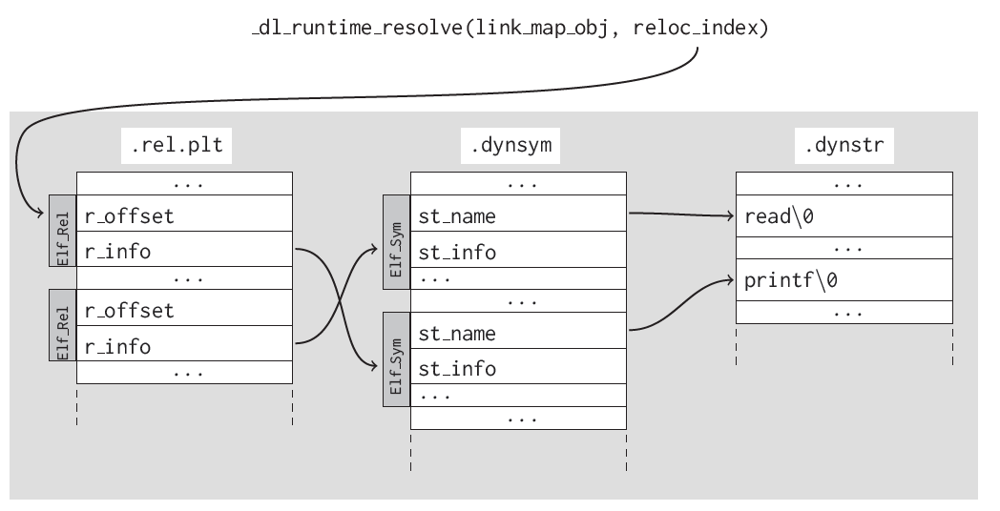

# Dynamic Linking

??? note "Version History"
	|Date|Description|
	|:---|-----------|
	|Dec 24, 2020| Adopted from my previous [note](https://github.com/lastweek/source-glibc)|

:rowboat:

For code pointers, see the glibc code [here](https://github.com/lastweek/source-glibc).

## C Start Up (csu)

In glibc:

- `csu/libc-start.c`
- `__libc_start_main()` is the entry point.
  Inside, it will call `__libc_csu_init()`.
  Then it will call user's `main()`.
- Great reference: [Linux x86 Program Start Up](http://dbp-consulting.com/tutorials/debugging/linuxProgramStartup.html).
  I saved a printed [PDF copy](assets/Linux-x86-Program-Start-Up.pdf) in this repo.

## Dynamic Linking in User Space

The dynamic linker/loader `ld.so` is part of glibc.

I was particularly interested in how it resolves the dynamic symbols during
runtime. I took a brief read of the source code and found some relevant ones.

### ld.so

- ELF's `.interp` section points to the dynamic linker, and here it is.
- Related code: `elf/rtld.c`, `sysdep/generic`, `sysdep/x86_64/`, and more
- Inside `dl_main()`, you can see how `LD_PRELOAD` is handled.
- `GOT[1]` contains address of the `link_map` data structure.
- `GOT[2]` points to `_dl_runtime_resolve()`! This is the runtime dynamic linker entry point.

File `sysdep/generic/dl-machine.c` populates `GOT[1]` and `GOT[2]`.
```c
/* Set up the loaded object described by L so its unrelocated PLT
   entries will jump to the on-demand fixup code in dl-runtime.c.  */

static inline int
elf_machine_runtime_setup (struct link_map *l, int lazy)
{
  extern void _dl_runtime_resolve (Elf32_Word);

  if (lazy)
    {
      /* The GOT entries for functions in the PLT have not yet been filled
         in.  Their initial contents will arrange when called to push an
         offset into the .rel.plt section, push _GLOBAL_OFFSET_TABLE_[1],
         and then jump to _GLOBAL_OFFSET_TABLE[2].  */
      Elf32_Addr *got = (Elf32_Addr *) D_PTR (l, l_info[DT_PLTGOT]);
      got[1] = (Elf32_Addr) l;  /* Identify this shared object.  */

      /* This function will get called to fix up the GOT entry indicated by
         the offset on the stack, and then jump to the resolved address.  */
      got[2] = (Elf32_Addr) &_dl_runtime_resolve;
    }

  return lazy;
}
```

`_dl_runtime_resolve()` is architecture specific and has a mix of assembly and C code.
The flow is similar to the syscall handling: it first saves the registers,
then calling the actual resolver, then restore all saved registers.
For 64bit x86, the source code is in `sysdeps/x86_64/dl-trampoline.h`:
```asm
	.globl _dl_runtime_resolve
	.type _dl_runtime_resolve, @function
_dl_runtime_resolve:
	...
	...

	# Copy args pushed by PLT in register.
	# %rdi: link_map, %rsi: reloc_index
	mov (LOCAL_STORAGE_AREA + 8)(%BASE), %RSI_LP
	mov LOCAL_STORAGE_AREA(%BASE), %RDI_LP
	call _dl_fixup		# Call resolver.
	mov %RAX_LP, %R11_LP	# Save return value

	...
```

Bingo, `_dl_fixup()` is the final piece of the runtime dynamic linker resolver. We could find it in `elf/dl-runtime.c`, which is a file for on-demand PLT fixup.:
```c
/* This function is called through a special trampoline from the PLT the
   first time each PLT entry is called.  We must perform the relocation
   specified in the PLT of the given shared object, and return the resolved
   function address to the trampoline, which will restart the original call
   to that address.  Future calls will bounce directly from the PLT to the
   function.  */

DL_FIXUP_VALUE_TYPE
attribute_hidden __attribute ((noinline)) ARCH_FIXUP_ATTRIBUTE
_dl_fixup (
# ifdef ELF_MACHINE_RUNTIME_FIXUP_ARGS
	   ELF_MACHINE_RUNTIME_FIXUP_ARGS,
# endif
	   struct link_map *l, ElfW(Word) reloc_arg)
{
	...
}
```

Understanding this piece of code requires some effort. Happy hacking!

### Understanding

Most recent ELF produced by GCC is slightly different than
the ones described by previous textbook or papers.
The difference is small, though. You should use `man elf` to check latest.

- When a program imports a certain function or variable, the linker
  will include a string with the function or variable’s name in the
  `.dynstr` section.
- A symbol (Elf Sym) that refers to the function or variable's name in the `.dynsym` section,
  and a relocation (Elf Rel) pointing to that symbol in the `.rela.plt` section.
- `.rela.dyn` and `.rela.plt` are for imported variables and functions, respectively.
- `.plt` is the normal one, it has instructions.
- `.got` and `.got.plt` maybe the first is for variable, and the latter is for function.
  But essentially the same global offset table functionality.

Relationship among `.dynstr`, `.dynsym`, `.rela.dyn` or `.rela.plt`. Credit: [link](https://www.usenix.org/system/files/conference/usenixsecurity15/sec15-paper-di-frederico.pdf):


PIC Lazy Binding. Credit: [link](https://uclibc.org/docs/psABI-x86_64.pdf):


Also that nowadays, even an non-PIC binary will always have GOT and PLT sections.
In theory, it probably should use load-time relocation. I suspect GOT and PLT are adopted
for the following 2 reasons:
a) load-time relocation needs to
modify code and this not good during time.
Especially considering code section probably is not writable.
b) GOT/PLT's lazy-binding has performance win at start-up time. However, keep in mind that
GOT/PLT's lazy-bindling pay extra runtime cost!

Reading:

- [System V Application Binary Interface](https://uclibc.org/docs/psABI-x86_64.pdf)
- [How the ELF Ruined Christmas](https://www.usenix.org/system/files/conference/usenixsecurity15/sec15-paper-di-frederico.pdf)

## Dynamic Linking for Kernel Modules

- [ ] TODO!

I'm very interested in how kernel resolves all the dynamic symbols.
the code is in `kernel/module.c` but it is too large.

When I uses `readelf -a` on a kernel module, there are several new sections
like `.rela.text.unlikely` and I suspect this points to the should-be-patched locations.
