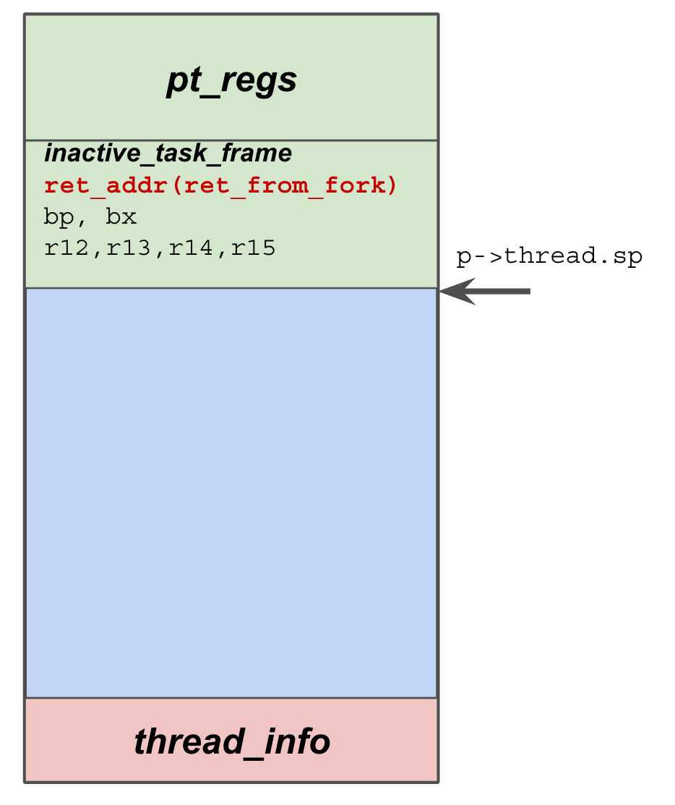

# Misc on Linux fork, switch_to, and scheduling

??? note "Version History"
	|Date|Description|
	|:---|-----------|
	|Oct 23, 2021| Initial|

So I had some whiskey and chips last night.
Sitting there watching TV, browsing random blogs.
Then I came across a blog I saved long time ago about linux switch_to history.
Then I recalled the moment I reliazed how switch_to/fork etc works, it was amazing.
So I decide to read the source code again and do some documentation.
I'm mostly reading my LegoOS code. This note is quite uncomplete though.
I won't have time going through the obvious.

## Prepare Kernel Stack and Function Pointers

copy_process() -> copy_thread().

This is the stack layout after `copy_thread()`.
Also the rough layout when the newly created thread is enqueued into runqueue.


The `copy_thread()` is architecture specific, I'm using x86 as an example.
This is a magic function as it plays with the stack, which is implicitly used by simply returning.
And this is confusing to a lot people, including myself when I got started.

Some facts about the kernel stack.
The kernel stack is allocated during fork() before we run into `copy_thread()`.
We can reference it by calling `task_stack_page(p)`.
The stack has a fixed size (maybe the latest version has changed this?), a configurable value called `THREAD_SIZE`, default is 2 pages I remember.
So the end (top) of the stack is simply `task_stack_page(p) + THREAD_SIZE`. Stack grows from top to bottom.
Hence, kernel uses a simple trick. It leverages the bottom of the kernel stack to save a struct called `thread_info`.
Quite an important data structure. The assumption is that kernel will not actually grow to the bottom. 
They do have a method to detect kernel stack corruption, I will not cover it here.

Alright, during `copy_thread()`, we basically have a "fresh" stack. We have copied everything from
the old stack to the new stack (done before calling into `copy_thread`).
The core job here is to setup the top of the stack, so that when this newly created thread can run
into certain predefined functions.

Top of the kernel stack is the `struct pt_regs`, this is true across the whole kernel.
So it is fairly easy to grab the pointer to it by using a simple macro called `task_pt_regs(p)`,
which just has simple pointer calculation.
Here, `copy_thread()` used a structure called `struct fork_frame`, which contains
a `struct inactive_task_frame` and a `struct pt_regs`. Again, leveraging the memory layout,
we can easily calculate the pointers to either structures.
Note, the `struct fork_frame` layout is crucial to understanding how fork'ed process gets running and how kernel thread runs into passed functions.

The bottom of the `struct fork_frame` is a field called `ret_addr`.
This is essentially the first function gets run when this newly created thread gets running (scheduled by runqueue). Here it is assigned to a function called `ret_from_fork()`, which
should be straightforward to understand. We will look into that later.
Alright, if this fork() is actually creating a kernel thread, we will save the kernel function
pointer and argument pointer to the `struct fork_frame` as well! All these info saved here
will be used later on in the assembly (`entry_64.S`).
```c

        childregs = task_pt_regs(p);
        fork_frame = container_of(childregs, struct fork_frame, regs);
        frame->ret_addr = (unsigned long) ret_from_fork;
        ...
        ... 
        /*
         * Save the kernel function pointer
         * and argument pointer to the `struct fork_frame`
         */
        if (unlikely(p->flags & PF_KTHREAD)) {     
                p->thread.pkru = pkru_get_init_value();     
                memset(childregs, 0, sizeof(struct pt_regs));     
                kthread_frame_init(frame, sp, arg);     
                return 0;     
        }     
```

Then the newly created thread will be enqueued into the runqueue.
Eventually it will gets running.

## Running For the first time after fork()

When the scheduler decides to run a thread, it will at least call `context_switch()`,
which internally calls `switch_to()`, which is just a macro around `__switch_to_asm`.
```c
#define switch_to(prev, next, last)                                     \    
do {                                                                    \    
        ((last) = __switch_to_asm((prev), (next)));                     \    
} while (0) 
```

`__switch_to_asm` is simply playing around the `struct fork_frame` we discussed above.
It first the current thread's state, switch stack (to the newly created thread's stack),
then starts popping out regs, eventually, only the `ret_addr` field remains in the stack!!

This is very important: we `jump` to the `__switch_to()` function.
Hence no return address will be pushed into the stack.
Later on, when `__switch_to()` finishes and returns, the hardware
will use the last field in the stack, which is the `ret_addr` field we placed there during `copy_thread()`! Elegant, isn't it? 

So, for a newly created process, the control flow is as follows
```c
context_switch (c)
__switch_to_asm (asm)
__switch_to (c)
ret_from_fork (asm)
   ==> return system call
   ==> run kernel function
```

Note the two lines switching stack.
The `TASK_threadsp` is actually referring to `p->thread.sp`.
For a newly created thread, `p->thread.sp` was set during `copy_thread()`
and it directly points to the starting address of `struct fork_frame`.

Note that there is a key difference with regard to normal threads scheduling,
i.e., threading got de-scheduled and scheduled again.
For the normal case, threads either willingly give up control or got preempted.
Either way, the kernel stack will have all the calling trace (different from
a newly forked thread's stack, which is clean), and the `p->thread.sp` points there.
Assume we have 2 threads A and B. A is originally running. A willingly goes to sleep by
calling schedule(), inside which, it eventually calls `context_switch()->__switch_to_asm()`.
This saves a return address to `context_switch()` into the bottom of the kernel stack (and
this is the `ret_field` position for `struct fork_frame`)!
When A got re-scheduled again, it runs into `__switch_to_asm` again.
Unlike the fork case, here the ret_field points to where A gave up control, essentially the original
`context_switch()`. So A will resume to `context_switch()` and run into `finish_task_switch()`.

```c
/*
 * %rdi: prev task
 * %rsi: next task
 */
ENTRY(__switch_to_asm)
        pushq   %rbp    
        pushq   %rbx    
        pushq   %r12    
        pushq   %r13    
        pushq   %r14    
        pushq   %r15    
    
        /* Switch stack */    
        movq    %rsp, TASK_threadsp(%rdi)    
        movq    TASK_threadsp(%rsi), %rsp    
    
        /* restore callee-saved registers */    
        popq    %r15    
        popq    %r14    
        popq    %r13    
        popq    %r12    
        popq    %rbx    
        popq    %rbp    
    
        /*
         * Note:
         * After popping out the above fields, now we only have
         * the `ret_field` left in the stack, which was pushed
         * into the stack by `copy_thread()`!
         * This is a *JUMP* to __switch_to() function!
         */
        jmp     __switch_to
END(__switch_to_asm)
```


I want to spend a few words on `ret_from_fork` as well.
It is a quite interesting function.
As we discussed above, a newly created thread will first run `ret_from_fork()`.
And it got into this function by simply return from `__switch_to()`.

As you can see, it will check whether we are creating a new kernel thread.
If it is, we will invoke the kernel function directly (this is how kthread
create new kernel thread). And this kernel thread is allowed to return
to userspace by calling exec and its friends!

```c
/*                                                                                           
 * A newly forked process directly context switches into this address.                                                                                           
 *                                                                                           
 * rax: prev task we switched from                                                                                           
 * rbx: kernel thread func (NULL for user thread)                                                                                           
 * r12: kernel thread arg                                                                                           
 */                                                                                           
ENTRY(ret_from_fork)                                                                                           
        movq    %rax, %rdi
        call    schedule_tail           /* rdi: 'prev' task parameter */
                                                                                           
        testq   %rbx, %rbx              /* from kernel_thread? */
        jnz     1f                      /* kernel threads are uncommon */
                                                                                           
2:                                                                                           
        movq    %rsp, %rdi
        call    syscall_return_slowpath /* return with IRQs disabled */
        SWAPGS                          /* switch to user gs.base */
        jmp     restore_regs_and_iret
                                                                                           
1:                                                                                           
        /* kernel thread */
        movq    %r12, %rdi
        call    *%rbx
        /*    
         * A kernel thread is allowed to return here after successfully    
         * calling do_execve().  Exit to userspace to complete the execve()    
         * syscall:    
         */
        movq    $0, RAX(%rsp)
        jmp     2b
END(ret_from_fork)
```

## Misc 

### Linux `current`

The `current` macro refers to the current running thread.
It is very convient variable and it works like magic before.
Long time ago, `current` is a macro that has a set of assmebly instructions
calculating the pointer to `task_struct` based on the current `kernel stack pointer`.
Since the kernel stack has a fixed size, so it is easy to derive the bottom of
the kernel stack by masking the current sp pointer. Then, kernel saved some extra
info there to make a connection to the task_struct. Simple and works well.

Nowadays, in x86, the current becomes a per-cpu variable. IMO, it is actually much cleaner.
The variable is called `current_task`. It got updated inside `__switch_to`.
`current` becomes a function reading the `current_task`, should is much lightweigh than old solutions.

### Linux `pt_regs`

PT stands for program trace. `pt_regs` includes the whole register status, very arch-specific.
They live at the top of the kernel stack. When a program trap from user to kernel space,
the first thing kernel would do is to construct such pt_regs (check `entry_64.S`).

However, things might got tricky though. Threads in kernel can be interrupted as well.
So we could have multiple `pt_regs` instances inside kernel stack frame.
So logically, there is a stack of `pt_regs`, and kernel code should use the right `pt_regs`
rather than blindly use the top of the kernel stack!

### Leveraging `ret` and `iret`

Kernel uses this trick a lot. At its core, `ret` and `iret`
transfer control to the addresses saved in the stack.
So if we change the saved addresses, C's `return XX`  becomes very magical.
It can return to unexpected places. This trick is used by `__switch_to_asm` and `ret_from_fork`.

### Kernel Exception Handling

Kernel can handle exceptions from kernel itself, or fixup exceptions.
Some of the exceptions are okay. Say `copy_from_user()`, there might be page fault during this call.
And kernel should be able to recognize that in the page fault handler and resume execution.