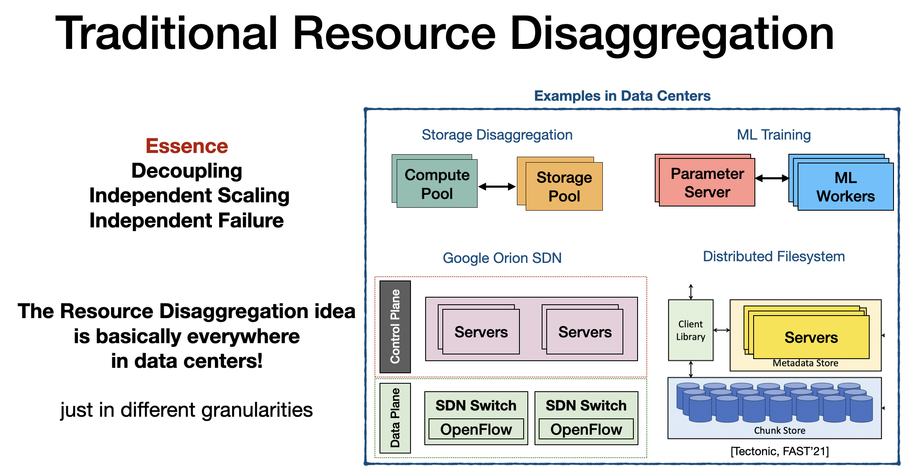
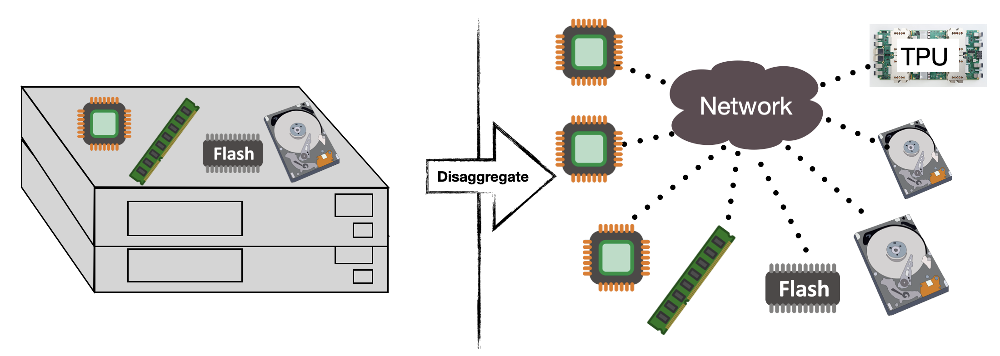
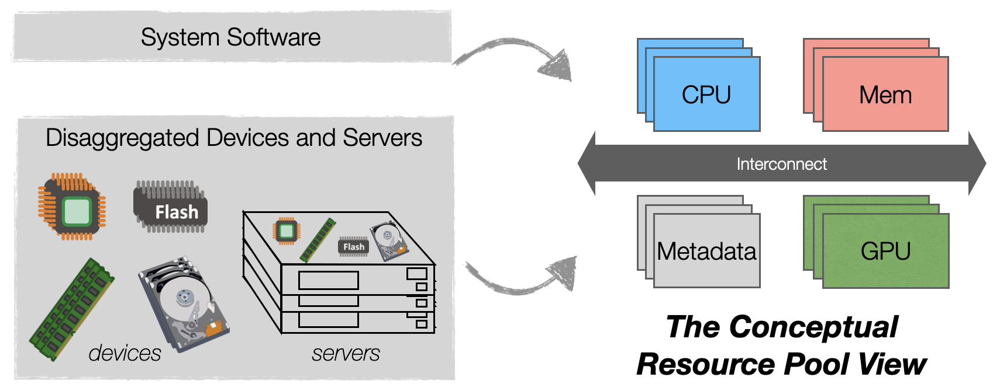
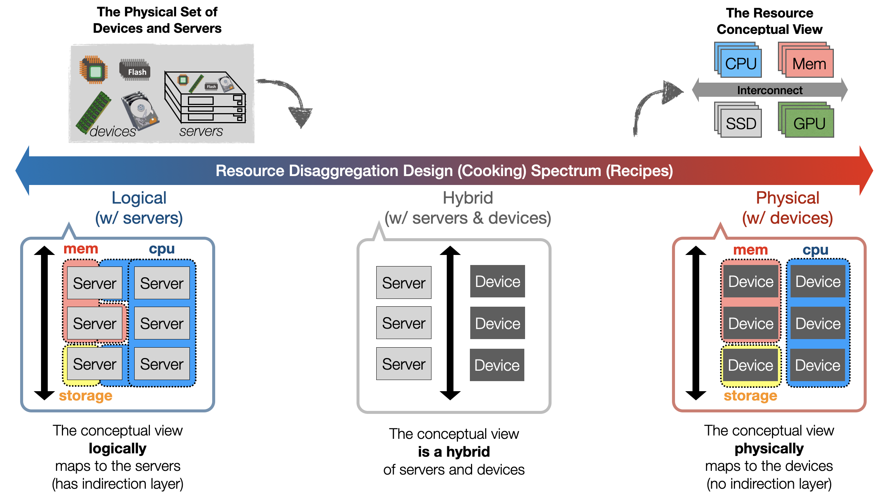
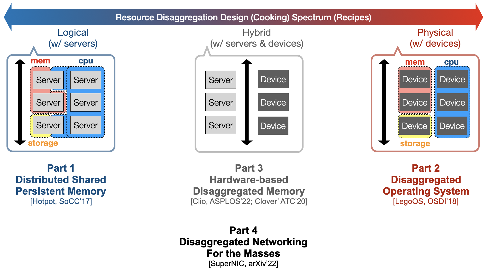

# Data Center Resource Disaggregation

??? note "Version History"
	|Date|Description|
	|:---|-----------|
	|Mar 7, 2022|Initial|

This note discusses the design spectrum for resource disaggregation.

We categorize the traditional distributed systems approach as
the *logical disaggregation approach*,
we categorize the newly emerged hardware resource disaggregation
as the *physical disaggregation approach*.
Combined, they are just two design extremes of resource disaggregation

Images are taken from my defense slides.
This is basically part of my defense's intro.

## Intro
**Resource Disaggregation** is a very general idea
with a wide design spectrum that covers many
design ideas and systems in data centers.
The essense of resource disaggregation
is to decouple resources so as to achieve independent
resource scaling and failing.
It has been applied in different *granularities*
and to many different domains.

The traditional resource disaggregation is usually
built on top of normal monolithic servers using normal distributed systems.
It is basically everywhere in data centers,
just appear in different granularities.
For example, in the classical storage disaggregation
deployment, storage pools are disaggregated from compute pools;
in machine learning deployment, paramemter servers are disaggregated
from workers; in typical SDN deployment, control plane servers
are disaggregated from data plane servers/switches.

---

**Hardware Resource Disaggregation** is a super HOT idea
that breaks the physical monolithic
servers into segregated, network-attached hardware resource pools,
each of which can be built, managed, and scaled independently.
The disaggregated approach largely increases the management
flexibility of a data center.

## Design Formula

I argue that the traditional resource disaggregation design approach
using distributed systems and the newly emerged hardware resource
disaggregation can be unified. They are two extreme design points.

Before we dig into the design spectrum.
I want to spent a few words on the **resource disaggregation formula**:
one would take a set of system software and a set of disaggregated
hardware devices or servers, then use whatever approach, to produce
the same ultimate goal, which is the **conceptual resource pool view**.
The pool can be a CPU pool, a memory pool, a Parameter Server pool.
Basically every standalone "conceptual" resource.
Think about the examples we mentioned earlier,
all systems follow this formula, just with different "resource pools".

## Design Spectrum

Now, the categorization.

On the far left, we have the **logical resource disaggregation**,
which represents the traditional resource disaggregation model.
This model builds on top of monolithic servers.
A server would contribute part or all its resource
to a certain resource pool. A server can be a part of multiple pools.
Usually, an indirection layer at each server
is required to achieve this goal.
Essentially, the ultimate resource pool just _**logically**_ maps
back to the actual servers.
This is the common-wisdon on building distributed systems.

On the far right, we have the **physical resource disaggregation**,
which represents the emerging hardware resource disaggregation model.
This model builds on top of disaggregated hardware devices.
Usually, no indirection layer is required.
So essentially, the ultimate resource pool could _**physically**_ maps
back to the actual physical devices.

In the middle, we have the *Hybrid Disaggregation* which
has the best of both worlds. It has both normal servers
and disaggregated devices.

The following image shows the design spectrum.

## My Work

So far, my work in this space has covered all grounds.
(DUH! I defined the specturm to fit my work! :-) )

