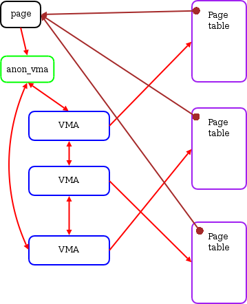

# Linux Reverse Mapping (`rmap`)

??? note "Version History"
	|Date|Description|
	|:---|-----------|
	|Jan 6, 2021 | minor update|
	|Jun 16, 2019 | add sanitizers section|

:octopus:

- [PDF: Object-based Reverse Mapping](https://landley.net/kdocs/ols/2004/ols2004v2-pages-71-74.pdf)
- [LWN: Virtual Memory II: the return of objrmap](https://lwn.net/Articles/75198/)
- [LWN: The object-based reverse-mapping VM](https://lwn.net/Articles/23732/)

Reserve map, or rmap, is a linux data structure used by the memory-management system.
It is a reverse mapping from the physical page back to the PTEs.
More specically, from the `struct page` back to the list of PTEs that point to the page.

The `rmap` data structure is used heavily by memory related system calls,
such as `mmap`, `munmap`, `madvise`, `brk`, and so on.
And it is used by both anonmouys and file-backed pages.
With the help of `rmap`, kernel is able to identify all the PTEs that point
a certain page. Therefore, when kernel is trying to, say evict the page,
it will be able to clear all the PTEs point to the page.

The `rmap` data structured is used by both user and kernel pages.
It makes the tracking of page sharing easier.

The `rmap` concept seems simple and straightforward to implement,
but it is very challenging to design a space- and performance-efficient one.
The linux kernel uses quite a lot of tricks to optimize the `rmap`.

You will understand how linux rmap works if you read the following articles carefully:




## Old Notes

I implemente the basic [PTE-chain based rmap for LegoOS](http://lastweek.io/lego/pcache/rmap/).
I can see the downsides of it. I tried to understand the
linux rmap before, somehow gave up because I couldn't fully
understand one thing:
for a page that is shared among multiple processes' VMAs, the source code
suggests it will always have same offset from the beginning of
_all_ VMA (i.e., `vm_start`). But does it actually works like this
for ALL cases? I just think it's possible that a page is mapped
by an VMA which has a slightly different starting address.

I still have doubt about it. But after accepting this assumption,
it's just easy to understand. I will check later on.

The code suggests:

- The offset of a page is saved in `page->index`.
- For anonmouys pages, the `page->index` is saved by [page_set_anon_rmap()](https://github.com/torvalds/linux/blob/e93c9c99a629c61837d5a7fc2120cd2b6c70dbdd/mm/rmap.c#L1027).
- When doing rmap walk over multiple VMAs:
  - For [anon](https://github.com/torvalds/linux/blob/e93c9c99a629c61837d5a7fc2120cd2b6c70dbdd/mm/rmap.c#L1824): `unsigned long address = vma_address(page, vma);`
  - For [file](https://github.com/torvalds/linux/blob/e93c9c99a629c61837d5a7fc2120cd2b6c70dbdd/mm/rmap.c#L1878): `unsigned long address = vma_address(page, vma);`
  - And  `vma_address()` is basically `page->index`

```c
	static inline unsigned long
	__vma_address(struct page *page, struct vm_area_struct *vma)
	{
		pgoff_t pgoff = page_to_pgoff(page);
		return vma->vm_start + ((pgoff - vma->vm_pgoff) << PAGE_SHIFT);
	}
```

Compared to basic PTE-chain based solution, object-based rmap:

__The real benefit__

- During page fault, we only need to set `page->mapping` to point to `struct anon_vma`,
  rather than allocating a new structure and insert.

__The downside__

- During rmap walk, we need extra computation to walk each VMA's page table
  to make sure that the page is actually mapped within this specific VMA.

Adding `struct anon_vma` is really similar to the idea of reusing `address_space`,
i.e., having a data structure trampoline.


Some more boring details:

- All pages within a single VMA share just one `anon_vma`.
  `vma->anon_vma` indicates if a VMA has attached or note.
  Related function is `anon_vma_prepare()` within `do_anonymous_fault()` [link](https://github.com/torvalds/linux/blob/e93c9c99a629c61837d5a7fc2120cd2b6c70dbdd/mm/memory.c#L2948).
