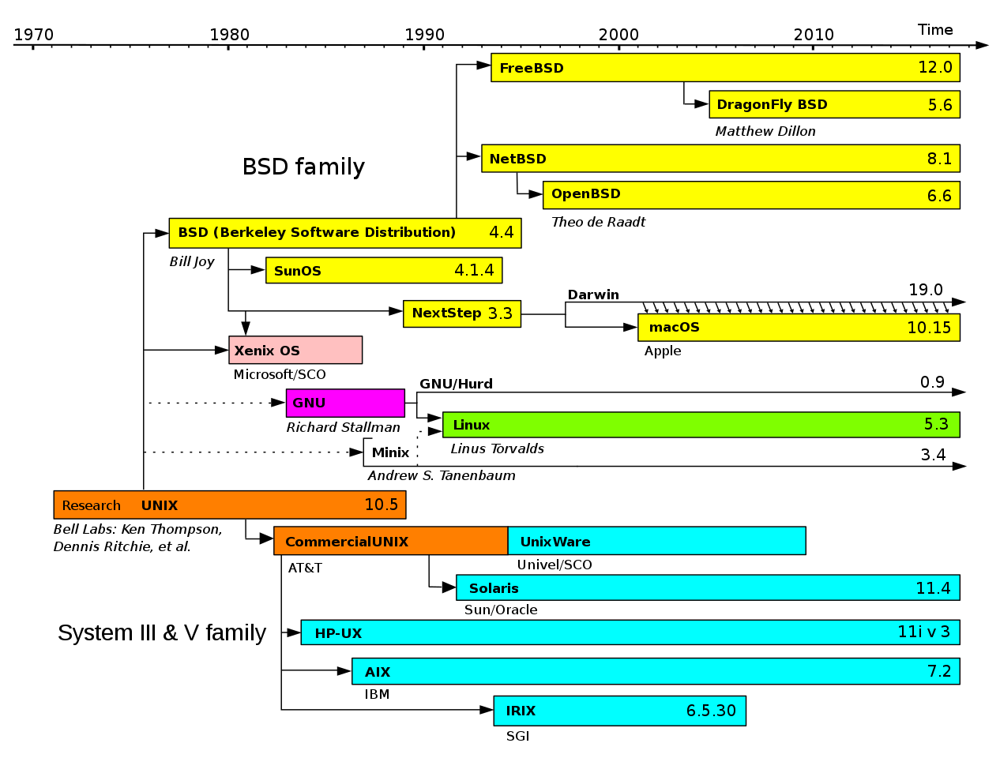

Source Code Study
---

??? note "Version History"
	|Date|Description|
	|:---|-----------|
	|Sep 13, 2020| some notes for python; add tcpstat|
	|Jul 26, 2020| Add OpenJDK! Hinted by Hacker News :)|
	|Jun 2, 2020| Add librcu|
	|Apr 26, 2020| Add wayland, X, gnome, gtk etc |
	|Apr 10, 2020| add graphics section|
	|Apr 6, 2020| add verbs perftes|
	|Mar 3, 2020| add FreeBSD, some fpga stuff |
	|Feb 4, 2020| add io_uring, firecracker|
	|Jan 31, 2020| Add some good stuff |
	|Jan 18, 2020| Initial|

Beautiful code is art.

- [Nutrition](#nutrition)
- [Operating Systems](#operating-systems)
- [Network](#network)
- [Virtualization](#virtualization)
- [Compilers](#compilers)
- [Firmware](#firmware)
- [FPGA](#fpga)
- [Web Servers](#web-servers)
- [Key Value Stores](#key-value-stores)
- [Databases](#databases)
- [RDMA and More](#rdma-and-more)
- [Graphics](#graphics)

## Nutrition

Projects supporting our day-to-day work.

- [GNU glibc: libc, elf, and dynamic linker](https://github.com/lastweek/source-glibc)
	- It is the default C library used by almost everyone
	- It includes `ld.so`, the dynamic linker
	- I wrote some notes about GOT/PLT and explains what has happend before main() is called.
- [GNU binutils: gas, static linker, and more](https://github.com/lastweek/source-binutils)
	- This repo has a lot commands like `as`, `ld`, `objdump`, `nm` and so on
	- `ld` is static linker and I like the magic of its linker script
	- I guess another useful repo is `elfutils`
- [Standard C Library](https://en.wikipedia.org/wiki/C_standard_library)
	- [GNU glibc](https://github.com/lastweek/source-glibc) used by major Linux distributions
	- [musl libc](https://musl.libc.org/about.html) is a small libc impl used by Alpine Linux. Clean code.
	- [uClibc](https://www.uclibc.org/about.html) is a small libc targeting embedded cases
	- [bionic](https://android.googlesource.com/platform/bionic/) is Android's C library, math library, and dynamic linker
- [strace](https://github.com/lastweek/source-strace)
	- System call tracer at userspace
	- I've designed [one](http://lastweek.io/lego/kernel/profile_strace/) for LegoOS in kernel space
- Unix Commands
	- Of course almost all other listed repos in this section have some sort of commands.
	  But they are not essential. The following repos have the essential UNIX commands like ls, cat.
	  It's not possible to go through all of them. But rather, I think they serve as references
	  when we want to know how certain things are implemented (e.g., how dmesg get kernel log).
	- [BusyBox](https://github.com/lastweek/source-busybox)
	- [GNU Coreutils](https://github.com/lastweek/source-coreutils)
	- [util-linux](https://github.com/lastweek/source-util-linux)
	- FreeBSD and its friends
- Tools
	- [tmux](https://github.com/lastweek/source-tmux)
	- [git](https://github.com/lastweek/source-git)
- Editors
	- [vim](https://github.com/lastweek/source-vim)
	- [neovim](https://github.com/lastweek/source-neovim)
- C for life
	- Some small and useful C projects
	- [cJSON](https://github.com/lastweek/source-cJSON): A lightweight JSON parser in C.
	- [userspace-rcu](https://github.com/lastweek/source-userspace-rcu): A userspace RCU implementation library.
- Outliers
	- [CRIU: Checkpoint and Restore in Userspace](https://github.com/lastweek/source-criu)
		- The reason I love this repo is because it has so many interesting pieces
		  on how to interact with kernel, save states, and restore them. In addition,
		  it shows how to properly use many less well known syscalls.
	- [GRUB2: bootloader](https://github.com/lastweek/source-grub2)
		- Learn how modern bootloader works.
		- Detailed analysis of Linux booting sequence (how it transit from
		  real-mode to protected mode, and finally to 64-bit mode,
		  how to navigate Linux source code etc.)
	- [FFmpeg](https://github.com/lastweek/source-FFmpeg)
		- FFmpeg project is famous for its clean and neat C code.
		- Besides, this project is used by a lot online video service companies
	- [io uring](https://kernel.dk/io_uring.pdf)
		- [user liburing](https://github.com/axboe/liburing)
		- [kernel io_uring.c](https://github.com/torvalds/linux/blob/master/fs/io_uring.c)

## Operating Systems

- [Linux 0.0.1](https://github.com/lastweek/linux-0.01)
- [Plan 9 OS](https://github.com/lastweek/source-plan9)
- [MSR Singularity.](https://github.com/lastweek/source-singularity)
- [illumos](https://github.com/lastweek/source-illumos-gate), a fork of the Oracle Solaris OS.
- [seL4 Microkernel](https://github.com/lastweek/source-seL4)
- [MacOS Darwin](https://github.com/lastweek/source-darwin-xnu)
- BSD: these repos have everything you can think of
	- If you ever wondered how X is done, how to get Y from OS, this is where you look into.
	- [FreeBSD](https://github.com/lastweek/source-freebsd)
	- [OpenBSD](https://github.com/openbsd/src)
	- [NetBSD](https://github.com/NetBSD/src)
	- [TrueOS](https://github.com/trueos/trueos)
- [Unikernel](http://unikernel.org/)
	- [OSv. A lightweight unikernel.](https://github.com/lastweek/source-osv)
	- [IncludeOS](https://github.com/lastweek/source-IncludeOS)
	- [Rumprun](https://github.com/lastweek/source-rumprun)
	- [Solo5. Unikernel as processes!](https://github.com/lastweek/source-solo5)

(Image source: https://commons.wikimedia.org/wiki/File:Unix_timeline.en.svg)

## Network

- [iperf3](https://github.com/lastweek/source-iperf) is a TCP, UDP, and SCTP network bandwidth measurement tool
- [tcpdump](https://github.com/lastweek/source-tcpdump)
- [OpenSSH](https://github.com/lastweek/source-openssh-portable) is our ssh!
- [scapy](https://github.com/lastweek/source-scapy): Python-based interactive packet manipulation program & library. Very neat
- [tcpstat](https://github.com/lastweek/source-tcpstat): C-based simple tool that could dump network traffic. Seems using pcap interface, the one used by tcpdump?
- Also checkout [FreeBSD](https://github.com/lastweek/source-freebsd) as it has tools like `ifconfig`, `if`. 

## Virtualization

Also see: http://lastweek.io/notes/source_code/virt/.

- [libvirt: virsh and more](https://github.com/lastweek/source-libvirt)
- [QEMU](https://github.com/lastweek/source-qemu)
- [Firecracker](https://github.com/lastweek/source-firecracker)
- [rust-vmm](https://github.com/rust-vmm/community)
- [cloud-hypervisor](https://github.com/cloud-hypervisor/cloud-hypervisor)
- Containers
	- runc in go.
	- containerd in go.
	- [docker](https://github.com/docker/docker-ce) in go.
	- [k8s](https://github.com/kubernetes/kubernetes) in go.

## Compilers

- [Clang, LLVM, in C++](https://github.com/llvm/llvm-project)
	- This is a collection of projects. Clang is the frontend,
	compiles C/C++ code into LLVM's own IR format.
	The the backend LLVM will take multiple Passes to optimize
	the IR and the finally generate the assembly.
	- The beauty of Clang and LLVM is that they can be used
	as libraries, and we could invoke them to manipulate the
	compilation results, to do source-to-source transforms,
	modify Pass's IR etc. I found this super interesting!
	- To get started, I strongly recommend [LLVM for Grad Students](https://www.cs.cornell.edu/~asampson/blog/llvm.html)
- [OpenJDK](https://github.com/lastweek/source-jdk)
	- **JRE = JVM + Runtime Classes** => JVM is the one parsing the bytecode, along with some extra classes/libraries, they form JRE.
	- **JDK = JRE + Development Tools** => JDK as in Development Kit therefore consists of some tools in addition to JRE.
	- JDK is a monster collection of resources in one place.
	  The JVM here is called `HotSpot`, a reference JVM implementation written in C++,
	  Since JDK also has so many runtime support, it has a lot Java code.
	- Personally I haven't written Java since 2013 or so.
	  Although I'm not using it anytime soon, I'm curious how it performs nowadays.
- [Python, in C](https://github.com/lastweek/source-cpython)
	- cpython, as its name suggested, whose core is written in C.
	  The core is within the [`Python`](https://github.com/lastweek/source-cpython/tree/master/Python) folder.
	- For those common [built-in functions](https://docs.python.org/3/library/functions.html),
	  they are organized here: https://github.com/lastweek/source-cpython/blob/master/Python/bltinmodule.c#L2878
- [GNU GCC](https://github.com/gcc-mirror/gcc)
- [Rustc, in Rust](https://github.com/lastweek/source-rust)
- [PHP, in C](https://github.com/lastweek/source-php-src)
- [Google V8, in C++](https://github.com/lastweek/v8)
- [Apple Swift, in C++](https://github.com/lastweek/source-swift)
- [TCL, in C](https://github.com/lastweek/source-tcl)
- [Perl 5, in C](https://github.com/lastweek/source-perl5)
- [Scala](https://github.com/scala/scala)
- [SpinalHDL]()

## Firmware

See here: http://lastweek.io/notes/source_code/20200506-on-firmware-softwares/.

The open-source firmware landscape:

## FPGA

- [My own Collection](https://github.com/lastweek/fpga_vivado_scripts)
- [My own Paper Readings](https://github.com/lastweek/fpga_readings)
- Partial Reconfiguration
    - [Partial Reconfiguration Building Framework](https://github.com/lastweek/fpga_pr_scripts)
    - [Intepret Xilinx Bitstream](https://github.com/lastweek/fpga_interpret_bitstream)
    - [HLS-based **ICAP** Controller](https://github.com/lastweek/fpga_icap_hls/)
- Network
	- [Corundum: an FPGA-based NIC](https://github.com/ucsdsysnet/corundum)
		- This is THE BEST network stack out there.
		- This is not simply a network stack, it is a NIC.
		- So what makes a NIC? First, PHY and MAC are basic.
		Second, PCIe connection between host and board.
		Third, DMA using PCIe, for TX and RX packets between host and board.
		Fourth, a host NIC driver;
		Fifth, some opt modules at NIC.
		- This project has it all. Most amazingly, it works on so many boards.
		- They have an FCCM'20 paper (finally!) describing the small modules inside.
	- [Verilog-Ethernet](https://github.com/lastweek/source-verilog-ethernet)
		- Self-made PHY, MAC IPs, ARP, IP, UDP stack
		- This is also used by the Corundum project.
	- [Limago, HLS-based 100 GbE TCP/IP](https://github.com/lastweek/source-Limago)
	- [FPGA Network Stack](https://github.com/fpgasystems/fpga-network-stack)
		- This one came from ETH as well.
		- This one is used by many papers, as far as i know, StRoM, EuroSys'20.
		- It's mostly HLS-based. And has ETH/IP/UDP/TCP, RoCE v2 stack.
- Simulation, Synthesis, and P&R
	- [Icarus iverilog](https://github.com/lastweek/source-iverilog).
	  iverilog is a compiler that translates Verilog source code into
	  executable programs for simulation, or other netlist formats for further processing [man page](https://linux.die.net/man/1/iverilog).
	- [VMware Cascade](https://github.com/lastweek/source-cascade).
	  Just-in-time compilation for Verilog, what a brilliant idea.
	- [Verilog-to-routing](https://github.com/lastweek/source-vtr-verilog-to-routing).
		- Synthesis (`ODIN II`)
		- Logic Optimization & Technology Mapping (`ABC`)
		- Placement and Route (`VPR`)

## Web Servers

- [Apache httpd](https://github.com/lastweek/source-httpd)
- [nginx](https://github.com/lastweek/source-nginx)

## Key Value Stores

Point of interests:
1) in-memory, and can it extend to use disk/ssd?
2) persistence support
3) network support

- [RocksDB: A persistent KVS for Flash and RAM Storage. C++](https://github.com/lastweek/source-rocksdb)
- [LevelDB. C++](https://github.com/lastweek/source-leveldb)
- [Memcached. C](https://github.com/lastweek/source-memcached)
- [Redis. C](https://github.com/lastweek/source-redis)
- [etcd: Distributed reliable KVS. Go](https://github.com/lastweek/source-etcd)

## Databases

- [MySQL](https://github.com/lastweek/source-mysql-server)
- [PostgresSQL](https://github.com/lastweek/source-postgres)
- [Yugabyte, distributed SQL](https://github.com/lastweek/yugabyte-db)

## RDMA and More

See here: http://lastweek.io/notes/source_code/rdma/

## Graphics

More here: http://lastweek.io/notes/source_code/20200501-on-graphic-softwares/

- [X Server](https://github.com/lastweek/source-xserver) and [Wayland](https://github.com/lastweek/source-wayland)
	- X is being replaced by Wayland now..
	- Wayland code seems clean
- [xvnc]()
	- xvnc and its friends, are sitting on top of display manager (i.e., X/Wayland).
	  They are clients of X/Wayland, but they act as X/Wayland servers for upper layer
	  application such as GTK/Qt.
	- It's a middleman, bringing network between X and GTK.
	- TigerVNC, TurboVNC and so on.
- [GNOME Shell and GTK](https://github.com/GNOME/gtk)
	- GTK's default backend is X.
	- GNOME shell is a layer on top of GTK+. Similar for KDE/Qt.
- [xRDP, an RDP server. In C](https://github.com/neutrinolabs/xrdp)
- [FreeRDP, client and server. In C](https://github.com/FreeRDP/FreeRDP)
	- Took a brief read of the code, it's super neat. Should take a serious look sometime.

This figure shows the software landscape:

