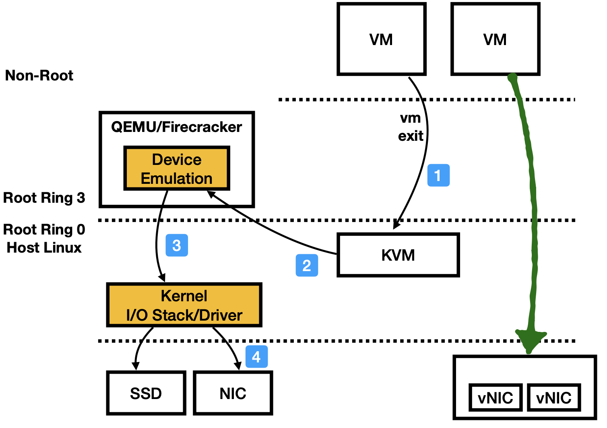
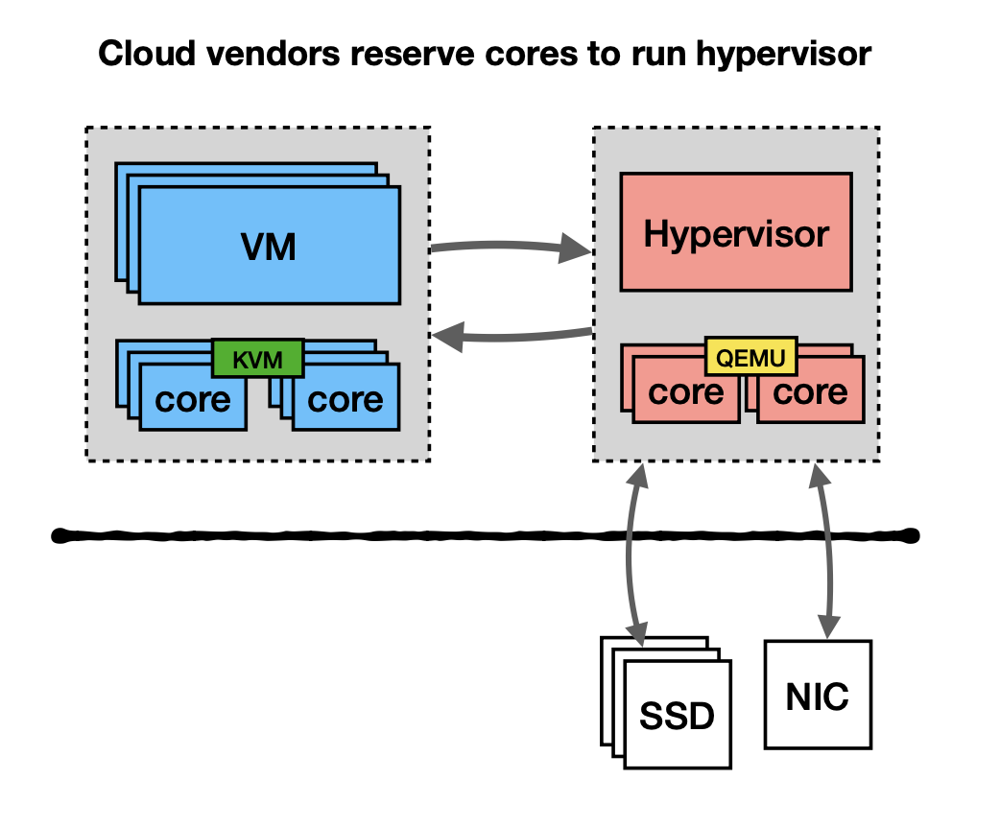
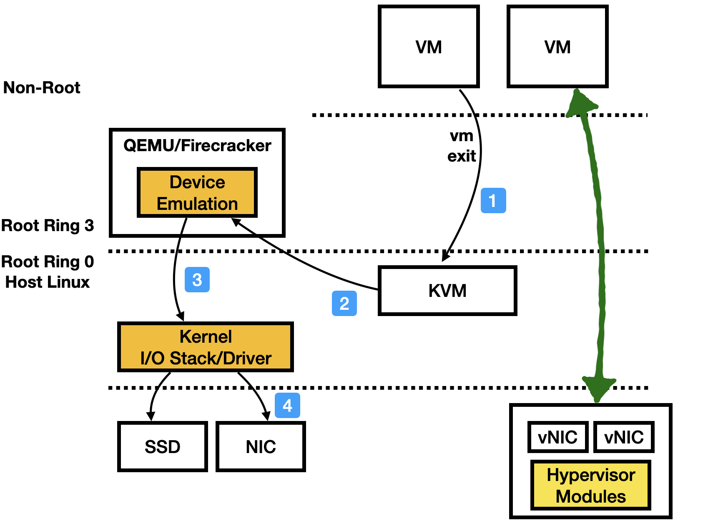
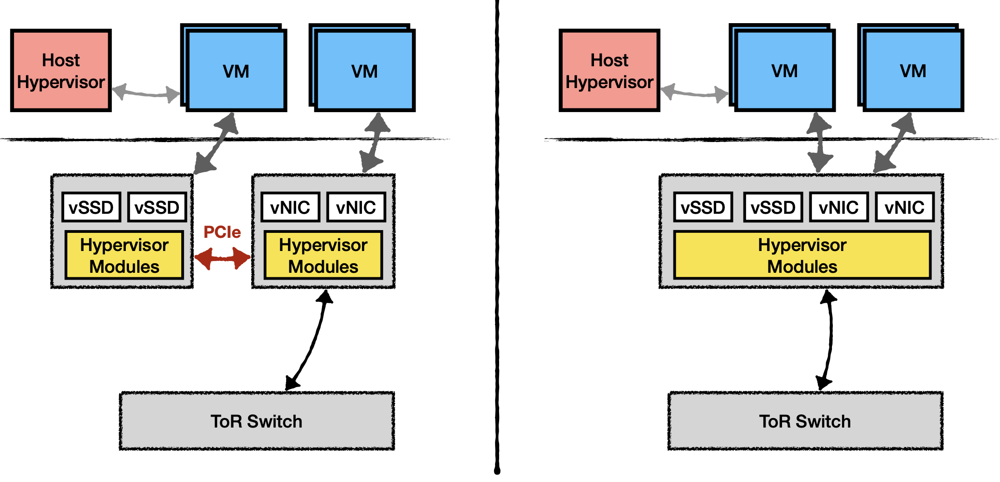

# Modern Virtualization Technology

??? note "Version History"
	|Date|Description|
	|:---|-----------|
	|Nov 19, 2021| Add slides|
	|Jun 22, 2021| add steps and bare-metal virt |
	|Dec 31, 2020| minor update|
	|Feb 4, 2020| Add VFIO stuff|
	|Jan 26, 2020| Minor adjustment|
	|Jan 25, 2020| Initial Document|

Deliverables

1.  <a href="http://lastweek.io/pubs/virt_note.pdf" target="_blank">Detailed note on QEMU/KVM/Others</a>
2.  <a href="http://lastweek.io/pubs/Virtualization_Cards_Yizhou_Shan.pdf" target="_blank">Slides on Cloud Virtualization Cards</a>

## Intro

This blog tries to cover a short history on virtualization,
the practices used by cloud vendors, the specialized virtualization cards (e.g., AWS Nitro),
and some detailed notes on QEMU/KVM.

I started this doc when I was trying to understand how virtualization actually works.
I was just reading QEMU/KVM and taking notes, but I end up exploring more.

Favorite quote about QEMU (in fact, about virtualization in general):

!!! quote
     And at the end of the day, all virtualization really means is running a particular set of assembly instructions (the guest OS) to manipulate locations within a giant memory map for causing a particular set of side effects, where QEMU is just a user-space application providing a memory map and mimicking the same side effects you would get when executing those guest instructions on the appropriate bare metal hardware

Also check out [Awesome-Virtualization](https://github.com/Wenzel/awesome-virtualization/issues).

## A Short History of Virtualization

1. Software-based Virtualization. This is where VMware started. No hardware support but just smart software tricks. You should read their papers.
2. Para-virtualization. This is what Xen invented. They changed the guest OS for a better emulation. No hardware support still. But the guest OS is changed.
3. Hardware-assited virtualization. This is what AMD and Intel Vt-d + IOMMU for. The CPU would support virtualization mode and non-virtualization mode (in x86, each mode has Ring 0-3). However, the hardware change alone cannot work. They must work a virtual machine monitor for at least device emulation and other things. This is where KVM and QEMU came in. KVM enables Linux to use those CPU features and turns Linux into a type-2 hypervisor. Userspace QEMU, acting as a VMM, helps setup KVM and emulates devices (QEMU can also do passthrough via VFIO).
4. Offload virtualization to dedicated hardware. This is what big cloud vendors are doing. For example, AWS Nitro cards, Mirosoft FPGA based SmartNIC cards.
Emulation is costly. Especially for I/O data path. This problem got worse since hardware is faster and faster (e.g., 100G networking).
So rather than relying on QEMU (or vendor kernel) to emulate storage/network/misc devices, these vendors build customized cards that would handle the "device emulation" part in hardware!
Other than that, vendors offload quite a lot hypervisor functionalaties as well. E.g., Microsoft offload OpenVSwitch alike modules to their FPGA (called GFT in the NSDI'18 paper).
Guest VMs, of course, are not aware any of these. They see the same MMIO spaces. This approach greatly saves host CPU usage, hence reduces Datacenter Virtualization Tax.
5. Bare-metal virtualization. Going back to where we started! Even with those great virtulization cards, the CPU still has virtualization modes enabled, and this has a cost!
In particular, the 2-level page table (EPT) is still in play and guest VMs will exit on certain instructions (e.g., CPUID). All these take a toll on performance even if the VM does no I/O.
Since vendors usually have 1-to-1 pCPU and vCPU mapping, this virtualization overhead is simply annoying and should be avoided.
Hence bare-metal virtualization, as in no hypervisors and no virtualization modes, yet we are still able to pack untrusted tenant VMs on one physical machine. Isn't this amazing?

## Details

Images below come from this slide I made: <a href="http://lastweek.io/pubs/Virtualization_Cards_Yizhou_Shan.pdf" target="_blank">Slides on Cloud Virtualization Cards</a>.

### KVM and QEMU/Firecraker Workflow

The following image shows the typical workflow when a VM tries to access I/O devices.
It will VM exit to the KVM module, which then dispatch (essentially return the ioctl call)
the events to the userspace hypervisor (e.g., QEMU, Firecracker).
Inside those hypervisors, there would be many implementation choices.
Say the VM is tring to send out a packet via the emualted NIC,
QEMU at this point will send out that packet using normal sockets (via host Linux).

This is the basic flow: VM -> KVM -> QEMU/Firecracker -> host Linux.
Internally, it could have many variantions.

The green line represents SR-IOV enabled passthrough path.
The VM can skip all hypervisor modules.
SR-IOV is an all-or-nothing solution, so, once enabled,
a cloud vendor / sysadmin has no way to control VM's usage on I/O devices.

### Cloud Vendors Reserve Cores to Run Hypervisor

Vendors would reserve cores to run the hypervisor.
For several important reasons. First, they want to have separate
processing provisioning. Second, to reduce switches on user core.
This is a common practice for some cloud vendors.
But they try to move away from it by using speciazed hardware
and save the cores for users.

## Modern Virtualization Hardware

Cloud vendors have been using specialized virtualization
cards to speed up virtualization and to reduce datacenter infrastructue tax.
Those cards are particularly useful for high-speed I/O devices (recall the workflow
we presented earlier, it has huge perf cost).
Examples include AWS Nitro cards, Microsoft FPGA based SmartNIC cards (NSDI'18).
You can use NVIDIA DPU or Intel IPU to build a similar one as well.

Those cards, essentially move the hypervisor modules into the hardware.
At a high-level, they are **"SR-IOV + Hardware-based QEMU"**.

For storage + NIC, they can have two discrete cards or a unified one.
The latter avoids the PCIe crossing. You can have NVMe-over-Fabric really easily.

## Detailed Note on QEMU/KVM

Below is the note I took when I was reading QEMU/KVM source code.
The questions I've focused on are:

- 1) how QEMU emulates all the devices.
- 2) how KVM uses CPU features to switch between VMs, catch faults, return to QEMU etc.
- 3) how KVM and QEMU work together.
- 4) how virto works and how device-passthrough works (via VFIO).
- 5) Finally, if I want to write a new virtual machine monitor like QEMU,
what should I build. Several recent projects (e.g., rust-vmm, firecracker) have hints on this.

- <a href="https://gdoc.pub/doc/e/2PACX-1vSsskD0A2XgHoZhaYLAkS7lmCOrfxkGXk1WTovWEAyeoELVdBjrE-NzD8h-NvJfKhxMpUg2aXzaD-XG" target="_blank">Google Doc Version</a>
- <a href="http://lastweek.io/pubs/virt_note.pdf" target="_blank">PDF Version</a>

<iframe style="width: 100%; height: 800px;" frameborder="1" allowfullscreen 
    src="https://docs.google.com/document/d/e/2PACX-1vSsskD0A2XgHoZhaYLAkS7lmCOrfxkGXk1WTovWEAyeoELVdBjrE-NzD8h-NvJfKhxMpUg2aXzaD-XG/pub?embedded=true">        
</iframe>
